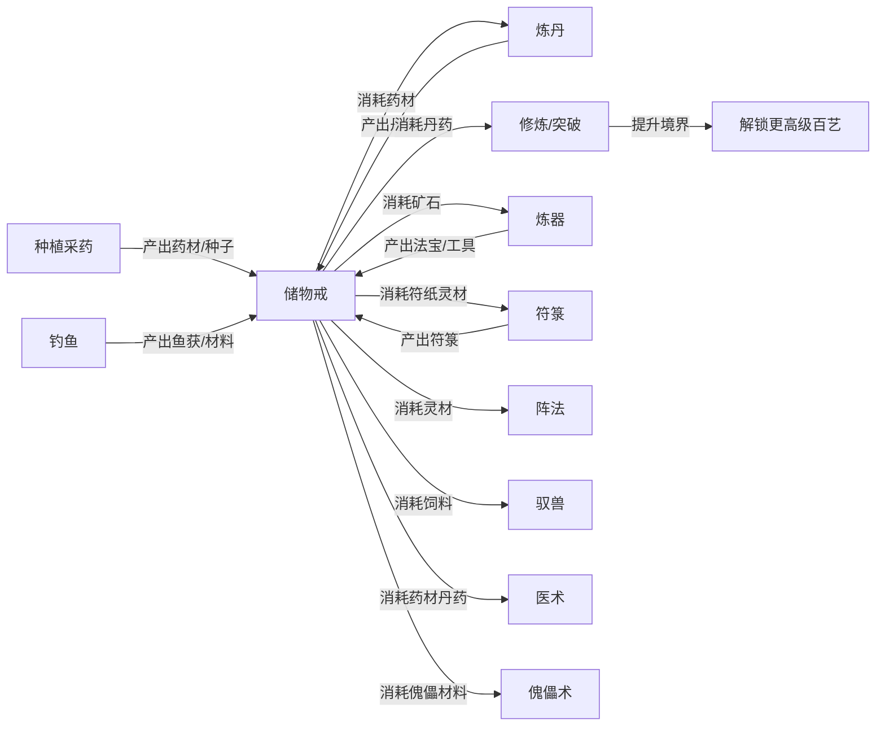
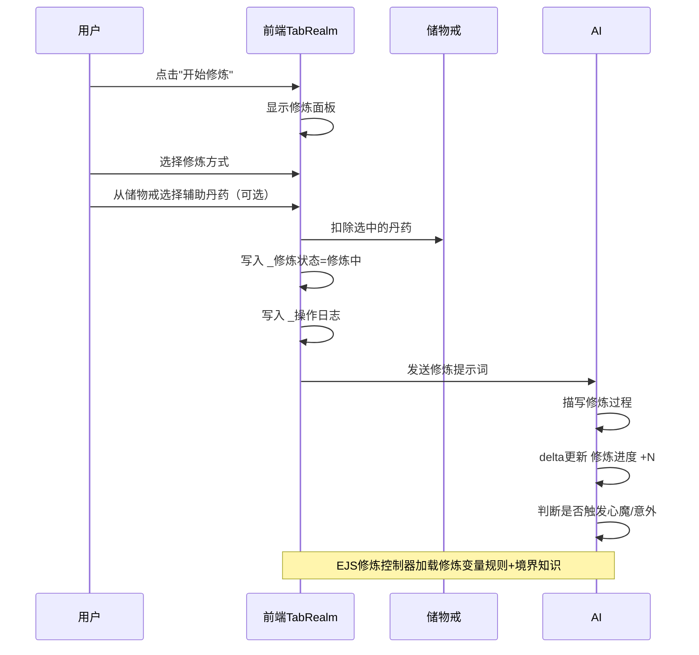
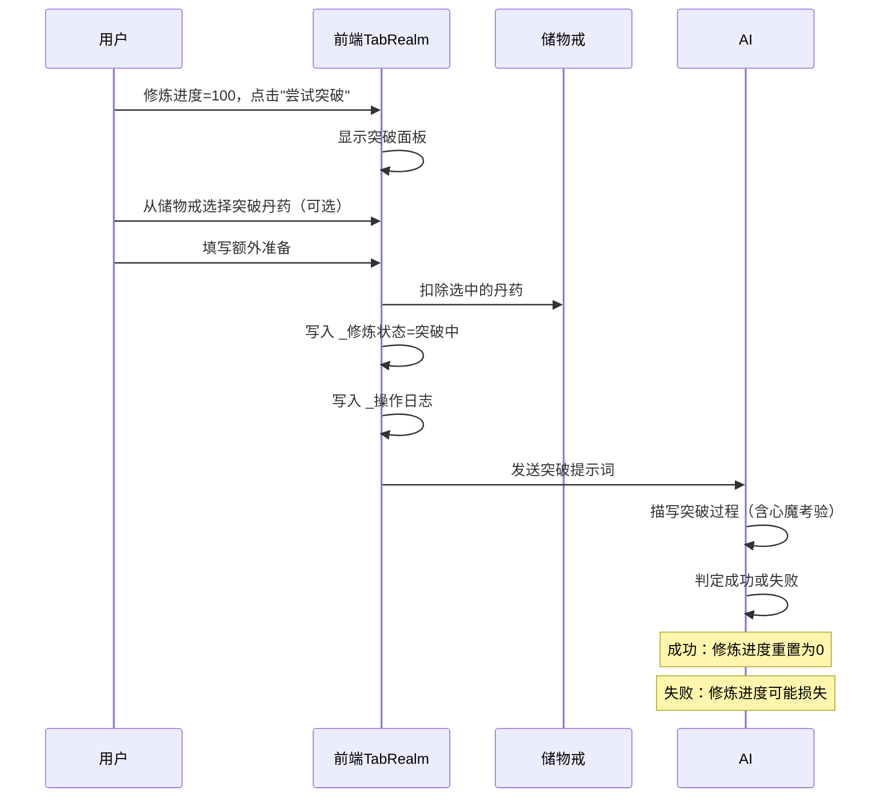
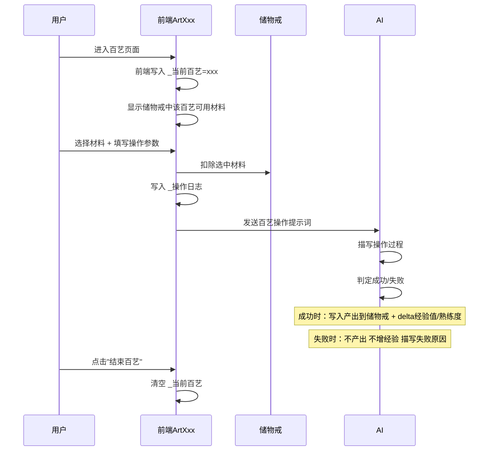
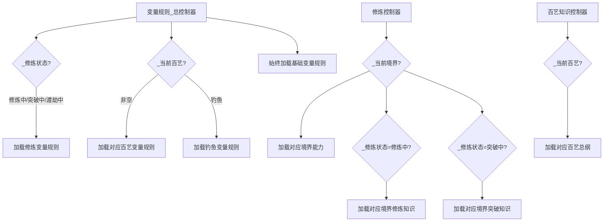

# 修仙世界重置版 —— 玩法体系重构技术方案

## 一、核心设计理念

### 1.1 物品循环闭环



### 1.2 前端 vs AI 职责划分

| 职责 | 前端控制 | AI控制 |
|------|---------|--------|
| 操作触发 | 用户点击开始修炼/百艺 | - |
| 材料选择 | 从储物戒按分类搜索选择 | - |
| 材料扣除 | 前端直接从储物戒移除 | - |
| 状态切换 | 写入 `_修炼状态`/`_当前百艺` | - |
| 操作日志 | 写入 `_操作日志` 记录操作详情 | - |
| 发送提示词 | 组装内容发送到酒馆 | - |
| 过程描述 | - | 描写修炼/炼丹等过程 |
| 成功/失败判定 | - | 根据材料、工具、境界综合判定 |
| 产出物品 | - | 成功时写入储物戒对应分类 |
| 经验值增长 | - | 成功时 delta 更新熟练度/经验值 |
| 修炼进度 | - | delta 更新修炼进度 |
| 装备槽 | 前端控制穿脱 | - |
| 境界/百艺境界 | 前端控制升级 | - |

**核心原则：前端负责"扣除"，AI负责"产出"。前端不加经验值，AI不扣材料。**

## 二、储物戒物品分类体系

### 2.1 分类前缀标准

| 前缀 | 说明 | 来源 | 消耗去向 |
|------|------|------|----------|
| `[药材]` | 灵药、灵草、灵果等原材料 | 种植采药、采集、购买、怪物掉落 | 炼丹、医术 |
| `[矿石]` | 金属矿石、玄铁、秘银等 | 采矿、购买、怪物掉落 | 炼器、傀儡术 |
| `[丹药]` | 炼制好的丹药 | 炼丹产出 | 修炼、突破、医术、直接使用 |
| `[符纸]` | 符箓用的纸张材料 | 购买、炼器产出 | 符箓 |
| `[灵墨]` | 符箓用的墨水材料 | 购买、采集 | 符箓 |
| `[符箓]` | 绘制好的符箓成品 | 符箓产出 | 直接使用、交易 |
| `[灵材]` | 通用灵性材料 | 多种途径 | 阵法、炼器、符箓 |
| `[阵旗]` | 布阵用的阵旗 | 炼器产出、购买 | 阵法 |
| `[饲料]` | 灵兽饲料 | 种植采药、购买 | 驭兽 |
| `[傀儡件]` | 傀儡零件和材料 | 炼器产出、购买 | 傀儡术 |
| `[种子]` | 灵药种子 | 采药、购买、收获 | 种植 |
| `[鱼获]` | 钓鱼获得的鱼类 | 钓鱼 | 烹饪、炼丹辅材、交易 |
| `[成品]` | 炼器成品法宝等 | 炼器产出 | 装备、交易 |
| `[杂物]` | 无分类标签的其他物品 | 各种途径 | 视具体物品 |

### 2.2 储物戒数据格式

```
[药材]千年灵芝×2|百年何首乌×5|聚灵草×20
[矿石]玄铁矿×10|秘银×3
[丹药]聚气丹×5|培元丹×2|突破丹×1
[符纸]黄符纸×30|玉符纸×5
[灵墨]朱砂墨×10
[种子]灵芝孢子×3|聚灵草种子×10
[鱼获]青灵鲤×2斤
[成品]寒铁剑×1
```

- 每行一个分类，`[分类]` 开头
- 同分类内物品用 `|` 分隔
- 物品格式：`物品名×数量` 或 `物品名×重量单位`
- 无标签行归属 `[杂物]`

### 2.3 前端解析函数设计

```typescript
interface StorageItem {
  category: string;  // 分类名，如 '药材'、'矿石'
  name: string;      // 物品名
  count: number;     // 数量
  unit: string;      // 单位，默认''，鱼获可能是'斤'
  raw: string;       // 原始文本
}

// 解析储物戒字符串 → 结构化数组
function parseStorage(storage: string): StorageItem[]

// 按分类筛选
function filterByCategory(items: StorageItem[], ...categories: string[]): StorageItem[]

// 扣除物品（精确匹配名称，减少数量，归零则移除）
function removeItem(storage: string, itemName: string, count?: number): string

// 将结构化数据序列化回字符串
function serializeStorage(items: StorageItem[]): string
```

## 三、修炼系统重构

### 3.1 修炼流程



### 3.2 突破流程



### 3.3 修炼变量更新规则

修炼中时AI只控制 `修炼进度` 的增量，其他 `_` 前缀变量由前端控制。

## 四、百艺玩法重构详细设计

### 4.1 通用百艺流程



### 4.2 各百艺消耗/产出映射表

| 百艺 | 消耗分类 | 产出分类 | 工具字段 | 特殊说明 |
|------|---------|---------|---------|----------|
| 炼丹 | `[药材]` | `[丹药]` | `_装备_丹炉` | 可选异火；丹品由AI判定 |
| 炼器 | `[矿石]` `[灵材]` | `[成品]` | `_装备_锻造台` | 可选锻造方式 |
| 符箓 | `[符纸]` `[灵墨]` | `[符箓]` | `_装备_符笔` | 绘制方式影响品质 |
| 阵法 | `[灵材]` `[阵旗]` | 存入`_阵盘_存放阵法` | `_装备_阵盘` | 消耗灵石作为阵眼 |
| 驭兽 | `[饲料]` | 灵兽状态提升 | `_装备_灵兽` | 训练/喂养灵兽 |
| 医术 | `[药材]` `[丹药]` | 治疗效果/配方 | `_装备_药箱` | 诊治NPC获好感 |
| 傀儡术 | `[傀儡件]` `[矿石]` | 傀儡状态提升 | `_装备_傀儡` | 制造/修复傀儡 |
| 种植采药 | `[种子]`(种植) / 无(采药) | `[药材]` `[种子]` | `_装备_一寸地` | 采药需特定地点 |

### 4.3 各百艺前端材料选择器设计

每个百艺组件不再让用户手动输入材料名，而是提供**从储物戒中选择**的交互：

1. 显示储物戒中该百艺可用分类的物品列表（带搜索）
2. 用户点选物品，选中后显示在"已选材料"区域
3. 用户可选择数量（默认1）
4. 发送时前端从储物戒精确扣除选中物品

### 4.4 通用材料选择器组件

创建 `components/StoragePicker.vue` 通用组件：

```
Props:
  - categories: string[]     // 要筛选的分类，如 ['药材']
  - title: string            // 选择器标题
  - multiple: boolean        // 是否允许多选
  - maxItems: number         // 最多选几种材料

Emits:
  - select: (items: {name: string, count: number}[]) => void
```

## 五、EJS控制器架构

### 5.1 总控制器加载逻辑



### 5.2 变量规则加载矩阵

| 条件 | 加载的变量规则 |
|------|--------------|
| 始终 | 基础变量更新规则 |
| `_修炼状态` 非空 | 修炼变量更新规则 |
| `_当前百艺` = 炼丹 | 炼丹变量规则 + 丹道境界规则 |
| `_当前百艺` = 炼器 | 炼器变量规则 |
| `_当前百艺` = 阵法 | 阵法变量规则 |
| `_当前百艺` = 符箓 | 符箓变量规则 |
| `_当前百艺` = 驭兽 | 驭兽变量规则 |
| `_当前百艺` = 医术 | 医术变量规则 |
| `_当前百艺` = 傀儡术 | 傀儡术变量规则 |
| `_当前百艺` = 种植采药 | 种植采药变量规则 |
| `_当前百艺` = 钓鱼 | 钓鱼变量规则 |

### 5.3 EJS控制器列表

| 控制器 | 文件 | 职责 |
|--------|------|------|
| 变量规则总控制器 | `变量规则_总控制器.yaml` | 根据状态加载变量规则 |
| 修炼控制器 | `修炼控制器.yaml` | 加载境界能力/修炼/突破知识 |
| 百艺知识控制器 | `修真百艺_知识控制器.yaml` | 加载百艺总纲 |
| 钓鱼EJS控制器 | `钓鱼EJS控制器.yaml` | 钓鱼时加载回复提示词+地点数据 |
| 其他现有控制器 | 保持不变 | 地图、道途、世界观等 |

## 六、变量更新规则模块设计

### 6.1 规则文件清单

| 文件 | 加载条件 | AI可更新的变量 |
|------|---------|---------------|
| 基础变量更新规则 | 始终 | 位置、身份、功法、储物戒、灵石、关系等 |
| 修炼变量更新规则 | `_修炼状态` 非空 | `修炼进度` |
| 炼丹变量规则 | `_当前百艺=炼丹` | `炼丹_熟练度` `炼丹_经验值` `储物戒`(添加丹药) |
| 炼器变量规则 | `_当前百艺=炼器` | `炼器_熟练度` `炼器_经验值` `储物戒`(添加成品) |
| 符箓变量规则 | `_当前百艺=符箓` | `符箓_熟练度` `符箓_经验值` `储物戒`(添加符箓) |
| 阵法变量规则 | `_当前百艺=阵法` | `阵法_熟练度` `阵法_经验值` |
| 驭兽变量规则 | `_当前百艺=驭兽` | `驭兽_熟练度` `驭兽_经验值` |
| 医术变量规则 | `_当前百艺=医术` | `医术_熟练度` `医术_经验值` |
| 傀儡术变量规则 | `_当前百艺=傀儡术` | `傀儡术_熟练度` `傀儡术_经验值` |
| 种植采药变量规则 | `_当前百艺=种植采药` | `种植采药_熟练度` `种植采药_经验值` `储物戒`(添加药材) |
| 丹道境界规则 | `_当前百艺=炼丹` | `丹道境界`(仅突破时) |
| 钓鱼变量规则 | `_当前百艺=钓鱼` | `钓鱼_成功次数` `钓鱼_鱼获记录` `钓鱼_最高记录` `储物戒`(添加鱼获) |

### 6.2 百艺变量规则统一模板

每个百艺的变量规则统一为以下格式：

```yaml
变量更新规则:
  # ═══ XX百艺（AI负责决定结果+经验增长） ═══
  # 前端已扣除材料，AI无需关心材料扣除
  # AI仅在操作成功时才增加经验值和熟练度

  XX_熟练度:
    type: number
    check:
      - 操作成功后+1~3（根据操作难度）
      - 操作失败时不增加
      - 满100时可突破到下一XX境界
  XX_经验值:
    type: number
    check:
      - 操作成功后+10~30（根据操作难度）
      - 满100溢出，熟练度额外+1，经验值归零
      - 操作失败时不增加

  储物戒:
    check:
      - 【操作成功时】将产出添加到储物戒对应分类
      - 【操作失败时】不添加任何产出，不扣材料（材料已由前端扣除）
```

## 七、前端文件改动清单

### 7.1 新增文件

| 文件 | 说明 |
|------|------|
| `components/StoragePicker.vue` | 通用储物戒物品选择器组件 |

### 7.2 重构文件

| 文件 | 改动要点 |
|------|---------|
| `store.ts` | 增加储物戒解析/搜索/扣除方法；导出EquipSlot类型 |
| `schema.ts`(状态栏) | 与脚本端schema保持一致 |
| `components/TabRealm.vue` | 修炼面板增加从储物戒选择丹药；突破面板同理 |
| `components/TabItems.vue` | 储物戒按分类分组显示+分类筛选 |
| `components/arts/ArtAlchemy.vue` | 材料从储物戒选择；移除前端加经验逻辑 |
| `components/arts/ArtForging.vue` | 同上 |
| `components/arts/ArtTalisman.vue` | 同上 |
| `components/arts/ArtFormation.vue` | 同上 |
| `components/arts/ArtBeast.vue` | 同上 |
| `components/arts/ArtMedical.vue` | 同上 |
| `components/arts/ArtPuppet.vue` | 同上 |
| `components/arts/ArtHerb.vue` | 种植消耗种子；采药按地点 |

### 7.3 store.ts 新增方法

```typescript
// ─── 储物戒物品管理 ───

/** 解析储物戒字符串为结构化数据 */
parseStorageItems(): StorageItem[]

/** 按分类筛选物品 */
getItemsByCategory(...categories: string[]): StorageItem[]

/** 从储物戒扣除物品（精确匹配，减少数量） */
removeStorageItem(itemName: string, count?: number): boolean

/** 获取所有分类列表 */
getCategories(): string[]
```

## 八、世界书条目对齐

### 8.1 变量规则文件

需要确保以下文件存在且内容正确：
- `[mvu_update]基础变量更新规则.yaml` — 已有，需更新储物戒格式说明
- `[mvu_update]修炼变量更新规则.yaml` — **新建**
- `[mvu_update]修真百艺_炼丹变量更新规则.yaml` — 已有，需微调
- `[mvu_update]修真百艺_炼器变量更新规则.yaml` — 已有，需微调
- 其余百艺规则 — 已有，需微调
- `[mvu_update]钓鱼变量更新规则.yaml` — 已有
- `[mvu_update]变量输出格式.yaml` — 已有
- `[mvu_update]变量输出格式强调.yaml` — 已有
- `变量列表.yaml` — 已有
- `[initvar]变量初始化勿开.yaml` — 已有，需与schema同步

### 8.2 EJS控制器文件

需要确保以下控制器正确引用世界书条目名称：
- `变量规则_总控制器.yaml` — 需增加修炼变量规则加载
- `修炼控制器.yaml` — 已有，需确认条目名称
- `修真百艺_知识控制器.yaml` — 已有
- `钓鱼_变量规则控制器.yaml` — 已有
- 其他控制器保持不变

## 九、实施顺序

### Phase 1: 基础层（储物戒+Store）
1. `store.ts` 增加储物戒解析/操作方法
2. `StoragePicker.vue` 通用选择器组件
3. `TabItems.vue` 按分类显示储物戒

### Phase 2: 变量规则层
4. 更新基础变量更新规则（储物戒格式）
5. 新建修炼变量更新规则
6. 统一所有百艺变量规则

### Phase 3: EJS控制器层
7. 更新变量规则总控制器
8. 确认修炼控制器逻辑

### Phase 4: 前端交互层
9. 重构 TabRealm.vue（修炼+突破消耗丹药）
10. 重构所有百艺组件（8个）

### Phase 5: 对齐验证
11. schema.ts 两端对齐
12. initvar.yaml 对齐
13. 修仙世界.yaml 条目对齐
14. 全局一致性检查
