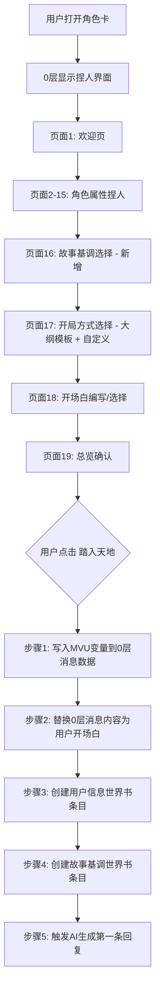

# 开场白重构方案 —— 深度设计文档

## 一、现状分析与问题

### 老版本开场白的问题
1. **变量未写入 MVU**: 老版本只把用户信息写入世界书的"用户信息"条目（纯文本），没有写入 schema.ts 定义的 MVU 变量（如 `灵根`、`大区域`、`所属势力`、`_当前境界` 等），导致状态栏无法正确显示
2. **0层未替换**: 确认后创建了一条用户消息 + 触发 AI 回复，但 0 层仍然是捏人界面的 HTML，没有替换为用户的开场白
3. **缺少故事基调**: 没有让用户选择叙事风格，AI 无法根据用户偏好调整剧情走向
4. **开局方式不够丰富**: 只有简单的标签选择，缺少结构化的大纲开场白模板
5. **玩法覆盖不完整**: 新版增加了大量百艺系统、钓鱼系统、储物戒等，捏人时应能设置初始百艺装备

## 二、新版开场白架构总览

### 2.1 整体流程



### 2.2 三大核心操作

| 步骤 | 操作 | API | 详情 |
|------|------|-----|------|
| 1 | 替换0层内容 | `setChatMessages()` | 将0层的捏人HTML替换为用户选择的开场白文本 + 写入MVU变量到data |
| 2 | 登记用户信息到世界书 | `createWorldbookEntries()` | 蓝灯条目，角色定义之前，不可互相激活 |
| 3 | 登记故事基调到世界书 | `createWorldbookEntries()` | 蓝灯条目，指定深度 系统 0 顺序 1，不可互相激活 |

## 三、捏人字段完整映射

### 3.1 用户输入 → MVU变量映射表

| 捏人字段 | MVU变量 | 类型 | 说明 |
|----------|---------|------|------|
| 道号 | `{{user}}` 酒馆用户名 | - | 不写变量，但写入世界书用户信息 |
| 性别 | 写入世界书 | - | 世界书用户信息条目 |
| 年岁 | `_剩余寿元` + `_寿元上限` | B类 | 根据境界计算寿元上限，剩余=上限-已活年数 |
| 灵根 | `灵根` | A类 | 严格格式：品级灵根·属性描述 |
| 体质 | 写入世界书 | - | 特殊体质写入用户信息 |
| 百艺 | `_当前百艺`（不设）+ 各百艺境界 | B类 | 初始百艺境界按选择设置 |
| 修为境界 | `_当前境界` + `_境界小境` | B类 | 前端控制，解析境界字符串 |
| 功法 | `主修功法` + `功法品级` + `功法总层数` + `功法已修层数` | A类 | AI可更新 |
| 术法 | `习得术法` | A类 | 格式：术法名(熟练度)，逗号分隔 |
| 法宝 | `_装备_武器` + `未装备_武器` | 混合 | 本命法宝→装备槽，其他→未装备 |
| 灵宠 | `_装备_灵兽` + `_灵兽状态列表` | B类 | 前端控制 |
| 异火 | `异火列表` | A类 | 格式：异火名\|异火名 |
| 势力 | `所属势力` | A类 | |
| 宗门地位 | `宗门地位` | A类 | 散修时为空 |
| 大区域 | `大区域` | A类 | |
| 子区域 | `子区域` | A类 | |
| 具体地点 | `具体地点` | A类 | |
| 身体状态 | 写入世界书 | - | 开场白中体现 |
| 初始资源 | `储物戒` + `下品灵石` 等 | A类 | 解析资源文本写入对应变量 |
| 剑心境界 | `剑心境界` | A类 | |
| 丹道境界 | `丹道境界` | A类 | |
| 背景故事 | 写入世界书 | - | 用户信息条目 |
| 开局方向 | 写入开场白 | - | 影响0层内容 |
| 故事基调 | 写入世界书 | - | 独立条目，蓝灯深度0 |

### 3.2 境界 → 寿元映射

```javascript
const REALM_LIFESPAN = {
  '凡人': 100,
  '炼气': 150, '筑基': 300, '金丹': 800,
  '元婴': 2000, '化神': 5000, '炼虚': 15000,
  '合体': 40000, '大乘': 100000, '渡劫': 100000,
  '真仙境': 30000 // 基础，每重天+30000
};

// 境界字符串解析示例
// "炼气三层" → 大境界="炼气期", 小境="炼气三层"
// "筑基前期" → 大境界="筑基期", 小境="筑基前期"
// "真仙境三重天" → 大境界="真仙境", 小境="真仙境三重天", 寿元=90000
```

### 3.3 境界字符串解析逻辑

```javascript
function parseRealm(realmStr) {
  // 凡人
  if (realmStr === '凡人') return { major: '凡人', minor: '凡人', lifespanMax: 100 };

  // 炼气X层
  const lianqiMatch = realmStr.match(/^炼气(.+)层$/);
  if (lianqiMatch) return { major: '炼气期', minor: realmStr, lifespanMax: 150 };

  // XX前期/中期/后期/大圆满
  const stageMatch = realmStr.match(/^(筑基|金丹|元婴|化神|炼虚|合体|大乘|渡劫)(前期|中期|后期|大圆满)$/);
  if (stageMatch) return { major: stageMatch[1] + '期', minor: realmStr, lifespanMax: REALM_LIFESPAN[stageMatch[1]] };

  // 真仙境X重天
  const zhenxianMatch = realmStr.match(/^真仙境(.+)重天/);
  if (zhenxianMatch) {
    const level = parseChineseNum(zhenxianMatch[1]);
    return { major: '真仙境', minor: realmStr, lifespanMax: level * 30000 };
  }

  return { major: '凡人', minor: '凡人', lifespanMax: 100 };
}
```

## 四、故事基调系统设计

### 4.1 设计理念

故事基调决定了 AI 在整个游戏过程中的叙事策略。它不是简单的标签，而是一套**完整的叙事指令**，会影响：
- 遇到的角色境界范围（与用户境界挂钩）
- 剧情事件的类型倾向
- NPC 对用户的态度倾向
- 挑战难度的分布
- 感情线的浓度

### 4.2 故事基调选项（多选制）

#### 4.2.1 核心玩法基调（必选一项）

| 基调 | 说明 | AI叙事策略 |
|------|------|-----------|
| 🗡️ 升级流 | 以修炼突破为核心，稳步变强 | 围绕用户当前境界展开，NPC境界不超过用户2个大境界；侧重修炼奇遇、功法感悟、突破契机 |
| 🐷 扮猪吃老虎 | 低调装弱，关键时刻一鸣惊人 | 频繁安排看轻/挑衅用户的NPC；用户出手时制造巨大反转；旁观者震惊 |
| 👑 天命之子 | 奇遇连连，气运逆天 | 高密度安排机缘：残破功法、上古传承、偶遇强者收徒；但也有对应的劫难 |
| 🌊 逆天改命 | 从绝境中崛起，以弱胜强 | 初始处境艰难（被追杀/废灵根/失忆），通过努力和机缘逆转命运 |
| 🏠 种田养成 | 经营发展为主，战斗为辅 | 侧重百艺玩法（炼丹/种植/炼器/钓鱼）、宗门建设、收集资源、NPC交互 |
| ⚔️ 争霸天下 | 以势力争斗为核心 | 宗门政治、势力博弈、战场指挥、结盟背叛、大规模战争 |

#### 4.2.2 附加风格标签（可多选）

| 标签 | 效果 |
|------|------|
| 💕 纯爱 | 感情线专一深刻，不安排第三者强行插入，NPC感情发展自然渐进 |
| 💔 虐恋 | 感情线跌宕起伏，误会、分离、生死考验，最终是否圆满取决于用户选择 |
| 🎭 诡谲 | 大量伏笔、反转、阴谋论调，没有人是表面看起来的样子 |
| 😂 轻松 | 日常向，搞笑互动多，严肃剧情少，整体氛围愉快 |
| 🩸 黑暗 | 世界残酷真实，弱肉强食，好人没好报，道德灰色地带 |
| 🎯 硬核 | 严格遵守世界观规则，境界压制绝对，资源有限必须精打细算 |
| 🔥 热血 | 友情、信念、不屈的意志，正面迎接挑战，绝不退缩 |
| 🌸 唯美 | 文笔注重意境描写，山水画般的修仙世界，诗意化叙事 |
| 🗺️ 探索 | 大量未知区域、秘境、上古遗迹，强调探索未知的乐趣 |
| 👥 群像 | 丰富的NPC刻画，每个角色都有自己的故事线，世界不围绕用户转 |

#### 4.2.3 境界匹配规则

```
<故事基调_境界匹配>
核心原则：围绕用户当前境界展开故事

当前境界策略：
- 凡人~炼气: 接触的NPC主要为凡人、炼气、筑基修士，金丹为罕见强者
- 筑基: NPC主要为炼气~金丹，元婴为传说级存在
- 金丹: NPC主要为筑基~元婴，化神偶尔出现但不直接参与低级争斗
- 元婴: 开始接触更广阔的世界，化神~炼虚级别的大人物开始登场
- 化神及以上: 可以接触到世界的核心矛盾和顶级势力

绝对禁止：
- 低境界时不得让真仙境NPC无故出现在用户面前互动
- 高境界NPC即使出现也应保持神秘感，不主动与低境界修士深度交流
- 战斗对手的境界不应超过用户2个大境界（除非剧情需要且有合理解释）

例外情况：
- "扮猪吃老虎"基调: 可安排高境界NPC看轻用户，但需给用户反击机会
- "天命之子"基调: 可安排偶遇高人指点，但不得直接赠送逆天宝物
- "逆天改命"基调: 初始可安排高境界追杀，但需留下合理的逃生路线
</故事基调_境界匹配>
```

### 4.3 自定义故事基调

在预设选项之后提供一个大型文本框，允许用户自由描述：

```
提示文本：
在此描述你期望的故事风格（可选）：
例如：
- "我希望故事以师徒关系为核心展开，师父是个表面冷漠实则关心弟子的元婴修士"
- "我想要一段从北原魔土底层奴隶翻身的故事，前期极度压抑但后期爽感十足"
- "纯粹的修炼升级，减少感情线，多安排秘境探索和功法领悟"
```

### 4.4 故事基调世界书条目格式

```yaml
# 条目设置
名称: 故事基调
启用: true
激活策略: 蓝灯
插入位置: 指定深度, 系统, 深度0, 顺序1
递归:
  不可被其他条目激活: true
  不可激活其他条目: true

# 内容格式
<故事基调>
核心玩法: {用户选择}
风格标签: {用户选择的标签列表}
{如果有自定义描述}
玩家期望: {用户自定义文本}
{/如果}

叙事指令:
- {根据核心玩法生成的具体指令}
- {根据风格标签生成的具体指令}
- {境界匹配规则}

绝对禁止:
- {根据基调生成的禁止事项}
</故事基调>
```

## 五、大纲开场白模板库

### 5.1 设计原则

- 大纲开场白**不调用任何具体角色/NPC**
- 只描述**场景、氛围、初始处境**
- 留足空间让 AI 在第一条回复中发挥
- 根据用户选择的势力、位置、境界自动适配部分内容

### 5.2 开局模板列表

#### 通用型（不限势力/位置）

| 编号 | 名称 | 简介 | 适合基调 |
|------|------|------|---------|
| 1 | 🏠 宗门新丁 | 刚入宗门/势力，一切从头开始 | 升级流、种田 |
| 2 | 🗡️ 绝境逢生 | 重伤倒在荒野，记忆残缺 | 逆天改命 |
| 3 | 🎪 坊市初行 | 第一次来到修士聚集的城市 | 探索、轻松 |
| 4 | ⚡ 雷劫余生 | 突破失败/渡劫失败，境界跌落 | 逆天改命 |
| 5 | 🏔️ 秘境开启 | 百年一开的秘境入口显现 | 探索、天命 |
| 6 | 📜 遗迹传承 | 在洞穴中发现上古修士遗留 | 天命之子 |
| 7 | ⚔️ 宗门大比 | 一年一度的宗门比武大会 | 升级流、扮猪吃老虎 |
| 8 | 🌙 孤月独行 | 散修独自在野外赶路 | 任意 |
| 9 | 🏪 拍卖盛会 | 百年难遇的大型拍卖会 | 种田、探索 |
| 10 | 🔥 灭门之仇 | 宗门被灭/家族被灭的唯一幸存者 | 逆天改命、热血 |
| 11 | 👑 天下第一 | 已是当世巅峰，却感到无尽寂寞 | 争霸、群像 |
| 12 | 🎣 溪边垂钓 | 平静的一天，溪边钓鱼开始 | 种田、轻松 |
| 13 | 🧪 丹成九转 | 一颗即将炼成的丹药，却出了意外 | 种田、升级 |
| 14 | 🐉 灵兽机缘 | 在野外遇到一只受伤的灵兽 | 天命、探索 |
| 15 | 💀 死中求活 | 被强敌追杀，走投无路 | 逆天改命、黑暗 |
| 16 | 🏯 皇朝风云 | 皇朝朝堂上的一场辩论 | 争霸、诡谲 |
| 17 | 🌿 采药途中 | 深山采药时发现异象 | 种田、探索 |
| 18 | 👤 身世之谜 | 一封来历不明的信揭开身世 | 诡谲、逆天 |
| 19 | ⛵ 渡海寻仙 | 乘船前往海外仙岛 | 探索、唯美 |
| 20 | 🎭 玄渊城夜 | 灰色地带的不夜之城 | 黑暗、诡谲 |

#### 用户自定义开场白

最后提供一个大型文本框让用户完全自行编写开场白内容。

### 5.3 开场白模板内容生成逻辑

每个模板会根据用户已选择的属性动态生成，例如"宗门新丁"：

```
[根据用户数据动态生成]

{userData.name}，{根据性别描述}，年方{userData.age}。
{根据灵根描述}。{如果有体质则描述}。
{如果有势力}身为{userData.faction}的{宗门地位或"新弟子"}，
{否则}作为一名散修，{/如果}

此刻，{userData.name}正站在{根据位置生成场景描述}...

{根据开局模板的特色描述}
```

## 六、onConfirm 执行流程详细设计

### 6.1 步骤1: 写入MVU变量 + 替换0层消息

```typescript
async function onConfirm() {
  const wbName = getCharWorldbookNames('current').primary;
  if (!wbName) { alert('未绑定世界书'); return; }

  // ── 1. 解析境界 ──
  const realmInfo = parseRealm(userData.realm);
  const lifespan = realmInfo.lifespanMax;
  const remainLife = Math.max(0, lifespan - userData.age);

  // ── 2. 构建 MVU stat_data ──
  const statData = {
    // A类变量
    大区域: userData.domain,
    子区域: userData.regionCustom || userData.region || '',
    具体地点: userData.scene || '',
    在场角色: '',
    灵根: userData.rootString,
    道途: '', // AI后续判定
    所属势力: userData.faction === '散修' ? '' : userData.faction,
    宗门地位: userData.faction === '散修' ? '' : '外门弟子', // 默认
    阴阳历: '3转7纪482元·816年9月15日',
    时辰: '卯时',
    主修功法: userData.gongfaName || '',
    功法品级: userData.gongfaGrade || '',
    功法总层数: 0,
    功法已修层数: 0,
    习得术法: userData.artsDesc || '',
    剑心境界: userData.swordRealm || '',
    丹道境界: userData.alchemyRealm || '',
    异火列表: userData.fireName ?
      userData.fireName + (userData.fireRank ? '(' + userData.fireRank + ')' : '') : '',
    储物戒: buildInitialStorage(userData),
    下品灵石: parseInitialLingshi(userData.resources, '下品'),
    中品灵石: parseInitialLingshi(userData.resources, '中品'),
    上品灵石: parseInitialLingshi(userData.resources, '上品'),
    极品灵石: 0,
    凡俗货币: '',
    未装备_武器: userData.extraWeapons || '',
    未装备_防具: '',
    未装备_饰品: '',
    关系列表: {},
    钓鱼_成功次数: 0,
    钓鱼_鱼获记录: '',
    钓鱼_最高记录: '',

    // B类变量
    _操作日志: '',
    _当前百艺: '',
    _当前境界: realmInfo.major,
    _境界小境: realmInfo.minor,
    _修炼状态: '',
    修炼进度: 0,
    心魔状态: '无',
    _寿元上限: lifespan,
    _剩余寿元: remainLife,
    _寿元状态: remainLife > lifespan * 0.2 ? '正常' : '衰老',
    _轮回状态: '正常',
    _装备_武器: userData.weaponName ?
      userData.weaponName + (userData.weaponGrade ? '(' + userData.weaponGrade + ')' : '') : '',
    _装备_防具: '',
    _装备_饰品: '',
    _钓鱼状态: '空闲',
    _钓鱼_钓鱼次数: 0,
    装备_鱼竿: '',
    装备_鱼饵: '',
    装备_渔网: '',
    装备_钓箱: '',
    // ... 百艺境界全部初始化为空
    _装备_灵兽: userData.petName ? buildPetString(userData) : '',
    _灵兽状态列表: userData.petName ? buildPetStatus(userData) : '',
    // ... 其余B类变量保持默认
  };

  // ── 3. 替换0层消息 ──
  const openingText = buildOpeningText(userData);
  await setChatMessages([{
    message_id: 0,
    message: openingText,
    data: { stat_data: statData }
  }], { refresh: 'all' });

  // ── 4. 创建用户信息世界书条目 ──
  await deleteWorldbookEntries(wbName, e => e.name === '用户信息');
  await createWorldbookEntries(wbName, [{
    name: '用户信息',
    enabled: true,
    strategy: {
      type: 'constant',
      keys: [],
      keys_secondary: { logic: 'and_any', keys: [] },
      scan_depth: 'same_as_global'
    },
    position: {
      type: 'before_character_definition',
      role: 'system',
      depth: 0,
      order: 1
    },
    content: formatUserInfo(userData),
    probability: 100,
    recursion: {
      prevent_incoming: true,
      prevent_outgoing: true,
      delay_until: null
    },
    effect: { sticky: null, cooldown: null, delay: null }
  }]);

  // ── 5. 创建故事基调世界书条目 ──
  await deleteWorldbookEntries(wbName, e => e.name === '故事基调');
  await createWorldbookEntries(wbName, [{
    name: '故事基调',
    enabled: true,
    strategy: {
      type: 'constant',
      keys: [],
      keys_secondary: { logic: 'and_any', keys: [] },
      scan_depth: 'same_as_global'
    },
    position: {
      type: 'at_depth',
      role: 'system',
      depth: 0,
      order: 1
    },
    content: formatStoryTone(userData),
    probability: 100,
    recursion: {
      prevent_incoming: true,
      prevent_outgoing: true,
      delay_until: null
    },
    effect: { sticky: null, cooldown: null, delay: null }
  }]);

  // ── 6. 触发AI回复 ──
  await triggerSlash('/trigger');
}
```

### 6.2 0层消息替换后的内容

替换后的0层消息是一段**纯文本开场白**（不是HTML），它：
- 描述用户角色当前的场景状态
- 包含 `<StatusPlaceHolderImpl/>` 让正则替换为状态栏
- 包含 `<MapPlaceHolderImpl/>` 让正则替换为地图
- 不包含任何具体NPC的动作/对话
- 角色身份由 AI 在第1层回复中补充

### 6.3 用户信息世界书条目内容

```
<用户角色信息>
道号: {name}
性别: {gender}
年岁: {age}
灵根: {rootString}
{如果有体质} 体质: {constitution} {/如果}
修行百艺: {arts列表}
修为境界: {realm}
所属势力: {faction}
{如果有功法} 主修功法: {gongfaName} ({gongfaGrade}) {/如果}
{如果有背景} 背景故事: {background} {/如果}
{如果有灵宠} 灵宠: {petName} ({petSpecies}, {petRank}) {/如果}
{如果有异火} 异火: {fireName} ({fireRank}, {fireAttr}) {/如果}
</用户角色信息>
```

### 6.4 故事基调世界书条目内容

根据用户选择动态生成完整的叙事指令提示词，包含：
- 核心玩法策略
- 风格标签规则
- 境界匹配规则
- 用户自定义描述
- 绝对禁止项

## 七、新增页面设计

### 7.1 新增页面: 故事基调 (PAGE 16)

```
页面标题: 命途抉择
引导文字: 天道无常，万般命途皆在一念之间。
         汝期望这段仙途以何种方式展开？
         此选将影响整个世界对汝的态度。

[核心玩法基调 - 单选卡片]
升级流 / 扮猪吃老虎 / 天命之子 / 逆天改命 / 种田养成 / 争霸天下

[附加风格标签 - 多选按钮]
纯爱 / 虐恋 / 诡谲 / 轻松 / 黑暗 / 硬核 / 热血 / 唯美 / 探索 / 群像

[自定义描述 - 文本框]
```

### 7.2 改造页面: 开局方式 (PAGE 17→18)

改为两部分：
1. **大纲开场白选择**（卡片式，带简介描述）
2. **自定义开场白**（文本框）

如果用户选择了大纲模板，则自动填充对应模板的开场白文本到文本框中，用户可以在此基础上修改。

## 八、文件改动清单

| 文件 | 操作 | 说明 |
|------|------|------|
| `第一条消息/0.txt` | 重写 | 新版捏人HTML + JS |
| `正则/开场白.txt` | 同步 | 与0.txt保持一致 |
| `修仙世界.yaml` | 无需改动 | 已有正则规则 `<明月不孤独>` |

## 九、注意事项与边界情况

### 9.1 DOMContentLoaded 问题
老版本使用 `document.addEventListener('DOMContentLoaded', init)` 来初始化，但在酒馆助手环境中这个事件可能不会触发。不过由于这是正则替换后的纯HTML页面（不是通过webpack打包的前端界面/脚本项目），而是直接嵌入到消息楼层中，`DOMContentLoaded` 在这种场景下实际是可以工作的。但为了保险，保留 `init()` 的即时调用作为备选。

### 9.2 世界书操作的幂等性
- 在创建条目前先 `deleteWorldbookEntries()` 删除同名条目
- 确保不会重复创建

### 9.3 变量写入时机
- MVU变量写入 `data.stat_data` 是通过 `setChatMessages()` 直接写入0层消息的data字段
- 这样MVU框架能在后续消息中读取到这些初始变量

### 9.4 `refresh: 'all'` 的必要性
- 替换0层消息后需要 `refresh: 'all'` 来重新加载整个聊天
- 这会触发 `CHAT_CHANGED` 事件，确保所有脚本和界面重新初始化
