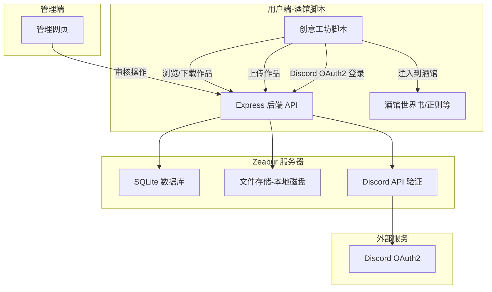
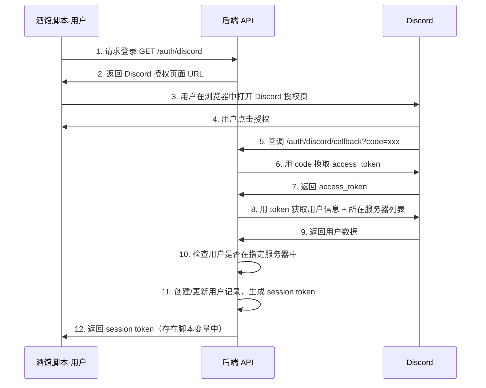

# 🎨 创意工坊 - 完整设计方案

## 一、项目概述

创意工坊是一个**云端内容分享平台**，以酒馆助手脚本的形式运行在 SillyTavern 中。用户可以：
- 通过 **Discord 账号登录**（必须是指定 Discord 服务器的成员）
- **上传** 自己的创作（世界书条目、正则美化、人设文本等）
- **浏览和下载** 经过三明月审核通过的其他用户创作
- 下载的内容可以**直接注入**到酒馆的世界书、正则等对应位置

三明月通过一个**独立的管理网页**来审核用户提交的内容。

---

## 二、整体架构



### 为什么选这些技术？

| 技术 | 选择理由 |
|------|----------|
| **Express.js** | 最简单的 Node.js 后端框架，代码少、文档多 |
| **SQLite** | 不需要额外装数据库，一个文件就是整个数据库，适合小型项目 |
| **本地文件存储** | Zeabur 支持持久化磁盘，上传的文件直接存在服务器上 |
| **Discord OAuth2** | 你的用户群在 Discord，用 Discord 登录最方便，还能验证是否在指定服务器 |

---

## 三、支持的内容类型

| 类型 | 说明 | 酒馆注入方式 |
|------|------|-------------|
| 世界书条目 | JSON 格式的世界书条目 | 调用 `replaceWorldbook` 注入 |
| 正则规则 | 酒馆正则表达式规则 | 调用正则相关 API 注入 |
| 人设文本 | 纯文本格式的角色人设 | 作为世界书条目注入或复制到剪贴板 |
| 预设片段 | 提示词片段 | 注入到预设或世界书 |

> 后续可以根据需要扩展更多类型

---

## 四、数据库设计

### 用户表 users

| 字段 | 类型 | 说明 |
|------|------|------|
| id | INTEGER PRIMARY KEY | 自增ID |
| discord_id | TEXT UNIQUE | Discord 用户 ID |
| discord_username | TEXT | Discord 用户名 |
| discord_avatar | TEXT | Discord 头像 URL |
| role | TEXT | 角色：user / admin |
| created_at | DATETIME | 注册时间 |
| last_login | DATETIME | 最后登录时间 |

### 作品表 works

| 字段 | 类型 | 说明 |
|------|------|------|
| id | INTEGER PRIMARY KEY | 自增ID |
| user_id | INTEGER | 上传者ID |
| title | TEXT | 作品标题 |
| description | TEXT | 作品描述 |
| type | TEXT | 类型：worldbook / regex / persona / preset |
| content | TEXT | 作品内容 (JSON 字符串) |
| tags | TEXT | 标签 (JSON 数组字符串) |
| status | TEXT | 状态：pending / approved / rejected |
| reject_reason | TEXT | 拒绝原因 |
| download_count | INTEGER | 下载次数 |
| created_at | DATETIME | 上传时间 |
| reviewed_at | DATETIME | 审核时间 |
| reviewed_by | INTEGER | 审核人ID |

### 点赞表 likes

| 字段 | 类型 | 说明 |
|------|------|------|
| id | INTEGER PRIMARY KEY | 自增ID |
| user_id | INTEGER | 点赞用户ID |
| work_id | INTEGER | 作品ID |
| created_at | DATETIME | 点赞时间 |

---

## 五、后端 API 设计

### 认证相关

| 方法 | 路径 | 说明 |
|------|------|------|
| GET | `/auth/discord` | 跳转到 Discord 登录页 |
| GET | `/auth/discord/callback` | Discord 登录回调 |
| GET | `/auth/me` | 获取当前登录用户信息 |
| POST | `/auth/logout` | 登出 |

### 作品相关（需要登录）

| 方法 | 路径 | 说明 |
|------|------|------|
| GET | `/api/works` | 获取已审核通过的作品列表（分页+搜索+筛选） |
| GET | `/api/works/:id` | 获取单个作品详情 |
| POST | `/api/works` | 上传新作品 |
| PUT | `/api/works/:id` | 修改自己的作品 |
| DELETE | `/api/works/:id` | 删除自己的作品 |
| POST | `/api/works/:id/like` | 点赞/取消点赞 |
| GET | `/api/works/:id/download` | 下载作品内容（增加下载计数） |
| GET | `/api/my/works` | 获取自己上传的所有作品 |

### 管理相关（需要 admin 权限）

| 方法 | 路径 | 说明 |
|------|------|------|
| GET | `/admin/works` | 获取待审核作品列表 |
| POST | `/admin/works/:id/approve` | 审核通过 |
| POST | `/admin/works/:id/reject` | 审核拒绝 |
| DELETE | `/admin/works/:id` | 强制删除作品 |
| GET | `/admin/users` | 用户列表 |
| POST | `/admin/users/:id/ban` | 封禁用户 |

---

## 六、Discord OAuth2 登录流程



### Discord 服务器验证

登录时会调用 Discord API 检查用户的服务器列表，只有在你**指定的 Discord 服务器**中的成员才允许登录。这需要：
1. 在 Discord Developer Portal 创建一个应用
2. 设置 OAuth2 回调地址为你的 Zeabur 后端地址
3. 在后端配置你的 Discord 服务器 ID

---

## 七、酒馆脚本前端设计

创意工坊脚本是一个**独立的新脚本**（`src/创意工坊/index.ts`），类似角色卡仓库的悬浮窗风格。

### 界面结构

```
┌──────────────────────────────────┐
│  创意工坊              [搜索] [×] │  ← 顶栏（可拖动）
├──────────────────────────────────┤
│ [广场] [我的作品] [上传] [个人]   │  ← Tab 切换
├──────────────────────────────────┤
│                                  │
│  ┌────┐ ┌────┐ ┌────┐ ┌────┐   │  ← 作品卡片网格
│  │ 作品 │ │ 作品 │ │ 作品 │ │ 作品 │   │
│  │ 标题 │ │ 标题 │ │ 标题 │ │ 标题 │   │
│  │ 作者 │ │ 作者 │ │ 作者 │ │ 作者 │   │
│  │ ♥ ↓ │ │ ♥ ↓ │ │ ♥ ↓ │ │ ♥ ↓ │   │
│  └────┘ └────┘ └────┘ └────┘   │
│                                  │
├──────────────────────────────────┤
│  < 1 2 3 ... > 共 24 个作品     │  ← 分页
└──────────────────────────────────┘
```

### 页面说明

| 页面 | 功能 |
|------|------|
| **广场** | 浏览所有已审核的作品，支持按类型/标签筛选、搜索、排序（最新/最热） |
| **我的作品** | 查看自己上传的作品和审核状态（待审核/已通过/已拒绝） |
| **上传** | 填写作品信息并提交（标题、描述、类型、标签、内容） |
| **个人** | Discord 账号信息、登录/登出 |

### 作品详情弹窗

点击作品卡片后显示详情：
- 作品标题、描述、作者
- 内容预览（格式化显示）
- **一键注入** 按钮（根据类型调用对应的酒馆助手 API）
- **下载为文件** 按钮
- 点赞按钮

---

## 八、管理后台网页

管理后台是一个**简单的网页**，部署在同一个 Zeabur 服务上（后端同时提供 API 和管理页面）。

### 功能

- 待审核作品列表
- 查看作品内容
- 通过/拒绝 按钮
- 用户管理（查看、封禁）
- 简单的数据统计（总作品数、总用户数、今日上传数）

### 地址

`https://你的域名/admin` —— 只有 role=admin 的用户（即你）能访问。

---

## 九、部署方案（Zeabur）

### 你需要做的事情（一步步来）

#### 第 0 步：创建 Discord 应用
1. 打开 https://discord.com/developers/applications
2. 点击 New Application，起个名字如 "三明月创意工坊"
3. 左侧菜单点 OAuth2
4. 记下 Client ID 和 Client Secret
5. 添加 Redirect URL（后面部署完才知道具体地址）

#### 第 1 步：创建新的 GitHub 仓库
1. 在 GitHub 上创建新仓库，比如叫 `workshop-server`
2. 把我帮你写好的后端代码推上去

#### 第 2 步：在 Zeabur 部署
1. 在朋友拉你的 Zeabur 项目中
2. 点击 "Add Service" → "Deploy from GitHub"
3. 选择 `workshop-server` 仓库
4. Zeabur 会自动识别这是 Node.js 项目并部署
5. 添加一个**持久化磁盘**（用于存储 SQLite 数据库文件）
6. 设置**环境变量**（Discord 密钥、管理员 ID 等）
7. 绑定一个域名（Zeabur 免费提供子域名）

#### 第 3 步：回到 Discord 设置回调地址
把 Zeabur 给的域名填回 Discord OAuth2 的 Redirect URL

#### 第 4 步：在酒馆脚本中配置后端地址
脚本代码中写入你的后端 API 地址

---

## 十、项目文件结构

### 后端（新的 GitHub 仓库 workshop-server）

```
workshop-server/
├── package.json
├── src/
│   ├── index.ts              # 入口：启动 Express 服务
│   ├── config.ts             # 配置（从环境变量读取）
│   ├── database.ts           # SQLite 数据库初始化和操作
│   ├── auth/
│   │   ├── discord.ts        # Discord OAuth2 逻辑
│   │   └── middleware.ts     # 登录验证中间件
│   ├── routes/
│   │   ├── auth.ts           # /auth/* 路由
│   │   ├── works.ts          # /api/works/* 路由
│   │   └── admin.ts          # /admin/* 路由
│   └── admin-page/
│       └── index.html        # 管理后台单页面
├── tsconfig.json
└── .env.example              # 环境变量示例
```

### 酒馆脚本（本项目中 src/创意工坊/）

```
src/创意工坊/
├── index.ts                  # 脚本入口
├── App.vue                   # 主组件（悬浮窗）
├── types.ts                  # 类型定义和常量
├── api.ts                    # 与后端 API 通信的封装
├── views/
│   ├── WorkshopView.vue      # 广场页（浏览作品）
│   ├── MyWorksView.vue       # 我的作品页
│   ├── UploadView.vue        # 上传页
│   ├── ProfileView.vue       # 个人信息页
│   └── WorkDetailModal.vue   # 作品详情弹窗
├── components/
│   ├── WorkCard.vue          # 作品卡片组件
│   └── ModalDialog.vue       # 通用弹窗
└── useAuth.ts                # 登录状态管理
```

---

## 十一、开发顺序和工时估算

| 阶段 | 内容 | 预计工作量 |
|------|------|-----------|
| 1 | 后端项目搭建 + Zeabur 部署教程 | 中等 |
| 2 | Discord OAuth2 登录系统 | 中等 |
| 3 | 后端 API（CRUD + 审核） | 中等 |
| 4 | 管理后台网页 | 较小 |
| 5 | 酒馆脚本前端 | 较大（主要工作量） |
| 6 | 联调测试 + 发布 | 较小 |

---

## 十二、安全考虑

- **Discord 服务器验证**：只有指定服务器的成员才能登录
- **审核机制**：所有上传内容必须经过管理员审核才能公开
- **内容大小限制**：单个作品内容限制在合理范围内（如 1MB）
- **频率限制**：API 请求频率限制，防止滥用
- **管理员权限**：只有你的 Discord ID 对应的用户是 admin
- **CORS 设置**：限制只有酒馆页面能访问 API
