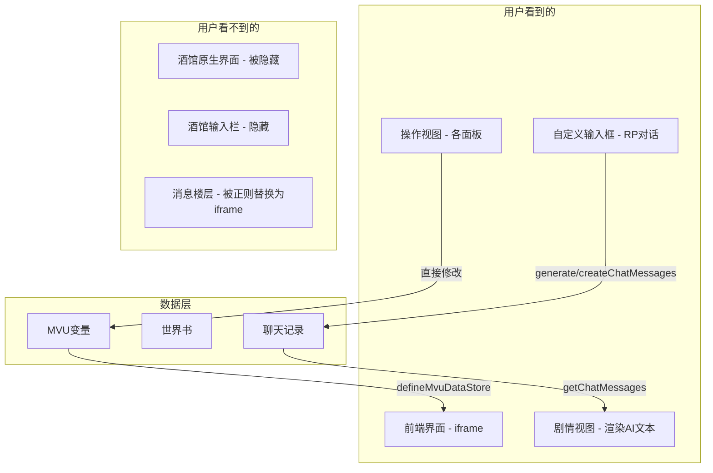

# 前端→AI 交互系统设计方案

## 核心架构：完全伪同层

**酒馆原生输入栏被隐藏，所有交互都在前端界面内完成。**

用户看到的只有前端界面（PC版/手机版），不会看到酒馆原生的消息列表和输入栏。

---

## 一、架构总览



---

## 二、隐藏酒馆输入栏

在隐藏楼层脚本中增加隐藏输入栏的逻辑：

```typescript
// 隐藏酒馆原生输入栏
$('#send_form').hide();
// 或者更彻底地隐藏整个底部区域
$('#form_sheld').hide();
```

---

## 三、自定义输入框

### 3.1 位置

在前端界面的**剧情视图**底部添加自定义输入框：

```
┌─ 剧情视图 ──────────────────────────────┐
│                                          │
│  [AI 叙事文本...]                         │
│  [AI 叙事文本...]                         │
│  [AI 叙事文本...]                         │
│                                          │
├──────────────────────────────────────────┤
│ ┌──────────────────────────────┐ [发送]  │
│ │ 在这里输入你的行动...          │         │
│ └──────────────────────────────┘         │
└──────────────────────────────────────────┘
```

### 3.2 发送逻辑

用户在自定义输入框中输入文本后点击发送：

```typescript
async function sendUserMessage(text: string) {
  // 1. 创建用户楼层
  await createChatMessages([{ role: 'user', message: text }]);

  // 2. 请求 AI 回复（携带预设提示词）
  const aiReply = await generate({ user_input: text });

  // 3. AI 回复会自动创建新楼层并触发 MVU 变量更新
  // 4. 前端界面自动刷新（因为 defineMvuDataStore 会监听变量变化）
}
```

### 3.3 流式显示

使用 `iframe_events.STREAM_TOKEN_RECEIVED_FULLY` 监听流式文本，在剧情视图中实时显示 AI 正在输出的内容：

```typescript
eventOn(iframe_events.STREAM_TOKEN_RECEIVED_FULLY, (token: string) => {
  // 实时追加到剧情视图
  appendStreamToken(token);
});
```

---

## 四、各系统的 AI 交互方式修正

### 4.1 强化系统

**之前**：前端 `generate` → AI 描写 → `createChatMessages`
**修正后**：相同，但不再需要"填入输入栏"的概念

```typescript
async function performEnhance(dimension: string, result: boolean, oldValue: number, newValue: number) {
  // 1. 前端已经完成了所有计算和变量修改

  // 2. 构造系统指令
  const prompt = `（系统：玩家对${mechName}进行了${dimension}强化，结果${result ? '成功' : '失败'}。` +
    (result ? `${dimension}从${oldValue}提升到${newValue}。` : `${dimension}维持在${oldValue}不变。`) +
    `请描写强化过程中机娘的反应。不要输出任何MVU变量命令。）`;

  // 3. 创建用户楼层（系统操作记录）
  await createChatMessages([{ role: 'user', message: prompt }]);

  // 4. 请求 AI 回复
  await generate({ user_input: '' });  // AI 会看到上面的用户楼层
}
```

### 4.2 改装系统

**之前**：填入酒馆输入栏让用户自行决定发送
**修正后**：在前端界面内弹出确认框，用户确认后自动发送

```typescript
async function onModInstall(mechName: string, modItem: ModItem) {
  // 1. 前端完成安装操作（变量修改）

  // 2. 弹出确认框：是否让AI描写机娘反应？
  const wantNarration = await showConfirmDialog(
    '安装完成',
    `已为${mechName}安装「${modItem.名称}」。是否让AI描写机娘的反应？`
  );

  if (wantNarration) {
    const prompt = `（系统：玩家为${mechName}安装了改件「${modItem.名称}」——${modItem.描述}。描写${mechName}的反应。）`;
    await createChatMessages([{ role: 'user', message: prompt }]);
    await generate({ user_input: '' });
  }
}
```

### 4.3 参赛报名

**之前**：直接发送
**修正后**：相同，前端直接调用 generate

```typescript
async function onEnrollConfirm(config: EnrollConfig) {
  // 1. 前端完成变量写入
  // 2. 如果是普通赛事，要求AI生成赛道
  const prompt = buildEnrollPrompt(config);
  await createChatMessages([{ role: 'user', message: prompt }]);
  await generate({ user_input: '' });
}
```

### 4.4 比赛过程

**之前**：用户在酒馆输入栏正常打字
**修正后**：用户在前端自定义输入框打字，前端调用 generate

这是最关键的变化——比赛中的 RP 对话也通过自定义输入框完成。

### 4.5 共鸣技能释放

**之前**：填入输入栏并发送
**修正后**：前端直接发送

```typescript
async function releaseResonance(skillName: string) {
  const prompt = `（我决定释放共鸣技能「${skillName}」！描写共鸣技能释放的震撼场面和效果。释放后共鸣值归零。）`;
  await createChatMessages([{ role: 'user', message: prompt }]);
  await generate({ user_input: '' });
}
```

---

## 五、剧情视图的渲染

### 5.1 当前实现

目前 [`App.vue`](src/我的机娘是世界级的/界面/PC版/App.vue:121) 中的剧情视图只渲染当前楼层的消息：

```typescript
const storyHtml = computed(() => {
  const msgs = getChatMessages(getCurrentMessageId());
  // ...
});
```

### 5.2 改进方向

需要渲染**多个楼层**的消息（至少最近几楼），形成连续的对话流：

```typescript
const storyHtml = computed(() => {
  const lastId = getLastMessageId();
  // 获取最近 N 楼的消息
  const startId = Math.max(0, lastId - 10);
  const messages = getChatMessages({ start: startId, end: lastId });

  return messages.map(msg => {
    const cleaned = cleanMessageText(msg.message);
    const isUser = msg.role === 'user';
    return `<div class="${isUser ? 'user-msg' : 'ai-msg'}">${textToStoryHtml(cleaned)}</div>`;
  }).join('');
});
```

---

## 六、需要修改/新建的文件

| 文件 | 操作 | 说明 |
|------|------|------|
| `界面/PC版/App.vue` | 修改 | 剧情视图底部添加自定义输入框 |
| 新建 `界面/PC版/components/ChatInput.vue` | 新建 | 自定义输入框组件 |
| 新建 `界面/PC版/aiInteraction.ts` | 新建 | 统一的 AI 交互工具函数 |
| `脚本/隐藏楼层/index.ts` | 修改 | 增加隐藏酒馆输入栏 |
| `界面/PC版/store.ts` | 修改 | 增加流式文本状态管理 |
| 之前所有方案中"填入输入栏"的设计 | 修正 | 改为前端内弹窗确认 + 直接发送 |

---

## 七、对之前方案的修正汇总

| 系统 | 原方案 | 修正后 |
|------|--------|--------|
| 改装系统 | 填入酒馆输入栏，用户自行发送 | 前端弹窗确认，确认后自动 generate |
| 强化系统 | generate → createChatMessages | 不变，但明确不涉及酒馆输入栏 |
| 参赛报名 | 直接发送 | 不变，前端直接 generate |
| 比赛RP | 用户在酒馆输入栏打字 | 用户在前端自定义输入框打字 |
| 共鸣释放 | 填入输入栏并发送 | 前端直接 generate |
