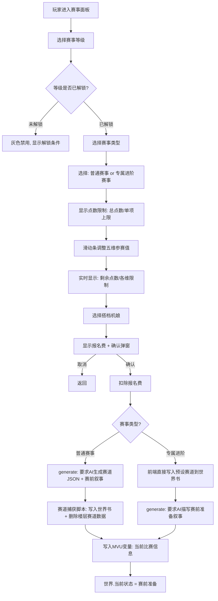
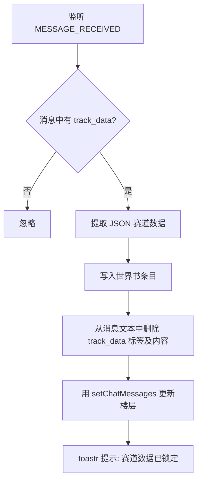

# 参赛配置系统设计方案

## 核心原则

1. **五维下调计算纯前端完成** — 滑动条调整，实时计算点数
2. **报名确认后直接发送 AI 请求** — 不填入输入栏，直接 generate
3. **赛道分两种来源**：专属进阶赛事（前端预写）和普通赛事（AI 生成精简 JSON）
4. **赛道数据对用户不可见** — 捕获后写入世界书，从楼层消息中删除

---

## 一、赛事体系

### 1.1 两种赛事类型

| 类型 | 赛道来源 | 特点 |
|------|---------|------|
| **普通赛事** | AI 生成精简 JSON | 每次不同的随机赛道，可重复参加 |
| **专属进阶赛事** | 前端预写完整赛道 | 每个等级的"毕业考试"，赛道固定且精心设计，通过后解锁下一等级 |

### 1.2 赛事等级与解锁条件

| 等级 | 解锁条件 | 可选赛事类型 | 专属进阶赛事 |
|------|---------|------------|------------|
| T5 新秀赛 | 初始解锁 | 场地赛、街道赛 | T5 晋级赛（通过后解锁 T4） |
| T4 城市赛 | T5 赛季积分 ≥ 100 | 场地赛、街道赛、漂移赛 | T4 晋级赛（通过后解锁 T3） |
| T3 区域赛 | T4 赛季积分 ≥ 200 | 全部 5 种 | T3 晋级赛（通过后解锁 T2） |
| T2 国家赛 | T3 赛季积分 ≥ 300 | 全部 5 种 | T2 晋级赛（通过后解锁 T1） |
| T1 洲际赛 | T2 赛季积分 ≥ 500 | 全部 5 种 | T1 晋级赛（通过后解锁 T0） |
| T0 世界赛 | T1 赛季积分 ≥ 1000 | 全部 5 种 | T0 总决赛（最终挑战） |

### 1.3 赛事类型与五维侧重

| 赛事类型 | 核心考验维度 | 说明 |
|---------|------------|------|
| 场地赛 | 极速、加速度、操控 | 封闭赛道多圈竞速 |
| 街道赛 | 操控、漂移、加速度 | 城市街道封路赛 |
| 拉力赛 | 耐久、操控、加速度 | 长距离多路况 |
| 漂移赛 | 漂移、操控 | 纯漂移评分赛 |
| 耐力赛 | 耐久、极速、操控 | 长时间持久赛 |

---

## 二、参赛配置流程



---

## 三、五维下调界面

### 3.1 界面布局

```
┌─ 赛事报名 ─────────────────────────────────────┐
│                                                  │
│ 赛事等级: [T5 ▾]  赛事类型: [场地赛 ▾]           │
│ 模式: ○ 普通赛事  ● 专属进阶赛事                  │
│                                                  │
│ ┌─ 点数限制 ──────────────────────────────────┐ │
│ │ 总点数: 150  单项上限: 50  剩余: 23          │ │
│ └──────────────────────────────────────────┘ │
│                                                  │
│ 加速度 ACC  [====●==========] 42 / 50  (原始:99) │
│ 极速   SPD  [======●========] 38 / 50  (原始:95) │
│ 操控   HDL  [==●============] 30 / 50  (原始:30) │
│ 漂移   DFT  [●==============] 15 / 50  (原始:15) │
│ 耐久   END  [===●===========] 25 / 50  (原始:55) │
│                                                  │
│ 搭档机娘: [兰月明 ▾]                              │
│ 报名费: 200 信用点  余额: 12,500                  │
│                                                  │
│         [取消]  [确认报名 ✓]                      │
└──────────────────────────────────────────────────┘
```

### 3.2 滑动条规则

每个维度的滑动条：
- **最小值**: 0
- **最大值**: `min(原始值, 赛事单项上限)`
- **默认值**: 最大值（即默认不下调）
- **步进**: 1（整数）
- 当五维总和超过总点数限制时，**确认按钮禁用**，显示红色提示

### 3.3 报名费表

| 赛事级别 | 报名费 |
|---------|--------|
| T5 | 200 |
| T4 | 500 |
| T3 | 1500 |
| T2 | 5000 |
| T1 | 20000 |
| T0 | 100000 |

---

## 四、赛道数据格式

### 4.1 普通赛事：AI 生成精简 JSON

赛道生成规则世界书条目改为要求 AI 输出精简 JSON：

```json
<track_data>
{"name":"银河城市赛道","loc":"东京","type":"街道","len":4.2,"turns":12,"maxSpd":290,"width":12,"surface":"沥青","elev":15,"safety":"B","weather":"多云偶阵雨","seg":[{"id":"S1","feat":"高速弯连续区","len":1400,"t":[{"id":"T1","type":"高速弯","ang":90,"spd":180,"diff":3,"note":"外侧有路缘石"},{"id":"T2","type":"发夹弯","ang":170,"spd":80,"diff":4,"note":"出弯下坡"}],"str":[{"len":800,"slope":"平","note":"DRS区"}]},{"id":"S2","feat":"技术弯道密集区","len":1200,"t":[{"id":"T3","type":"S弯","ang":120,"spd":130,"diff":3},{"id":"T4","type":"中速弯","ang":100,"spd":150,"diff":2}],"str":[{"len":400,"slope":"上坡3%"}]}],"overtake":["T3入口刹车区","S2末端直道"],"danger":["T2出口-雨天积水","T4外侧-井盖"],"pit":{"in":"T6后","out":"T8前","len":300,"limit":60},"lore":"曾经的F1街道赛场地，T4弯道被称为死亡之角"}
</track_data>
```

### 4.2 专属进阶赛事：前端预写完整赛道

专属赛道存储在 `trackData.ts` 文件中，每个等级一条精心设计的赛道。格式与精简 JSON 相同但更详细，每个弯道都有精确的参数。

专属赛道共 6 条（T5~T0 各一条），后续单独设计。

---

## 五、赛道捕获脚本改造

现有的 `脚本/赛道捕获/index.ts` 需要改造：

### 5.1 捕获流程变更



### 5.2 删除赛道内容

```typescript
// 捕获后删除楼层中的赛道数据
const cleanedMessage = msg.message.replace(/<track_data>[\s\S]*?<\/track_data>/gi, '').trim();
await setChatMessages(message_id, [{ message: cleanedMessage }]);
```

### 5.3 专属赛道的处理

专属进阶赛事不需要 AI 生成赛道，前端直接将预写赛道写入世界书：

```typescript
// 前端直接写入预设赛道
import { PROMOTION_TRACKS } from './trackData';

async function writePromotionTrack(tier: string) {
  const track = PROMOTION_TRACKS[tier];
  await writeTrackToWorldbook(JSON.stringify(track));
}
```

---

## 六、报名确认后的 AI 请求

### 6.1 普通赛事

前端 generate 的 prompt：

```
（系统指令：玩家已报名参加{赛事级别}{赛事类型}，搭档机娘为{机娘名}。
参赛五维配置：ACC={acc} SPD={spd} HDL={hdl} DFT={dft} END={end}。
请生成赛道数据（使用<track_data>JSON格式</track_data>），并描写赛前准备场景。
赛道数据将被系统自动捕获，不会显示给用户。）
```

### 6.2 专属进阶赛事

前端先写入预设赛道到世界书，然后 generate：

```
（系统指令：玩家已报名参加{赛事级别}专属晋级赛「{赛道名称}」，搭档机娘为{机娘名}。
参赛五维配置：ACC={acc} SPD={spd} HDL={hdl} DFT={dft} END={end}。
赛道数据已由系统预设，请直接描写赛前准备场景，介绍这条传奇赛道的氛围。）
```

---

## 七、变量操作

报名确认后，前端写入以下 MVU 变量：

```typescript
data.世界.当前状态 = '赛前准备';
data.当前比赛.赛事名称 = raceName;
data.当前比赛.赛事类型 = raceType;
data.当前比赛.赛事级别 = raceTier;
data.当前比赛.搭档机娘 = mechName;
data.当前比赛.参赛五维 = { 加速度: acc, 极速: spd, 操控: hdl, 漂移: dft, 耐久: end };
data.当前比赛.当前圈数 = 0;
data.当前比赛.总圈数 = 0; // AI 在赛道数据中指定
data.当前比赛.当前排名 = 0;
data.当前比赛.对手 = {}; // AI 在回复中生成
```

---

## 八、schema.ts 变更

需要新增解锁状态变量：

```typescript
主角: z.object({
  // ... 现有字段
  已解锁等级: z.enum(['T5', 'T4', 'T3', 'T2', 'T1', 'T0']).prefault('T5'),
  晋级赛通过记录: z.record(
    z.enum(['T5', 'T4', 'T3', 'T2', 'T1', 'T0']),
    z.boolean().prefault(false)
  ).prefault({}),
})
```

---

## 九、需要修改/新建的文件

| 文件 | 操作 | 说明 |
|------|------|------|
| `界面/PC版/panels/PanelEnroll.vue` | 重写 | 完整的赛事选择 + 五维下调 + 报名确认界面 |
| 新建 `界面/PC版/panels/enrollLogic.ts` | 新建 | 报名逻辑、点数计算、AI 请求发送 |
| 新建 `界面/PC版/panels/trackData.ts` | 新建 | 6 条专属进阶赛道的完整数据 |
| `脚本/赛道捕获/index.ts` | 改造 | 捕获后删除楼层赛道内容 |
| `世界书/赛道生成规则.yaml` | 重写 | 改为精简 JSON 格式要求 |
| `schema.ts` | 修改 | 新增已解锁等级、晋级赛通过记录 |

---

## 十、专属进阶赛道（待设计）

每个等级一条精心设计的赛道，后续在 `trackData.ts` 中详细编写：

| 等级 | 赛道名称（暂定） | 赛道类型 | 设计方向 |
|------|---------------|---------|---------|
| T5 | 新星训练场 | 场地赛 | 简单直白，2~3个基础弯道，考验基本功 |
| T4 | 都市霓虹环道 | 街道赛 | 城市街道，中等弯道密度，开始有策略空间 |
| T3 | 山岳试炼之路 | 拉力赛 | 山路+砂石，路况变化大，考验全面能力 |
| T2 | 国家竞技场 | 场地赛 | 专业赛道，高速弯+技术弯混合，改装件首次登场 |
| T1 | 洲际大奖赛道 | 耐力赛 | 长距离高难度，极限耐久考验 |
| T0 | 世界之巅 | 场地赛 | 终极赛道，所有类型弯道齐聚，传说级难度 |
