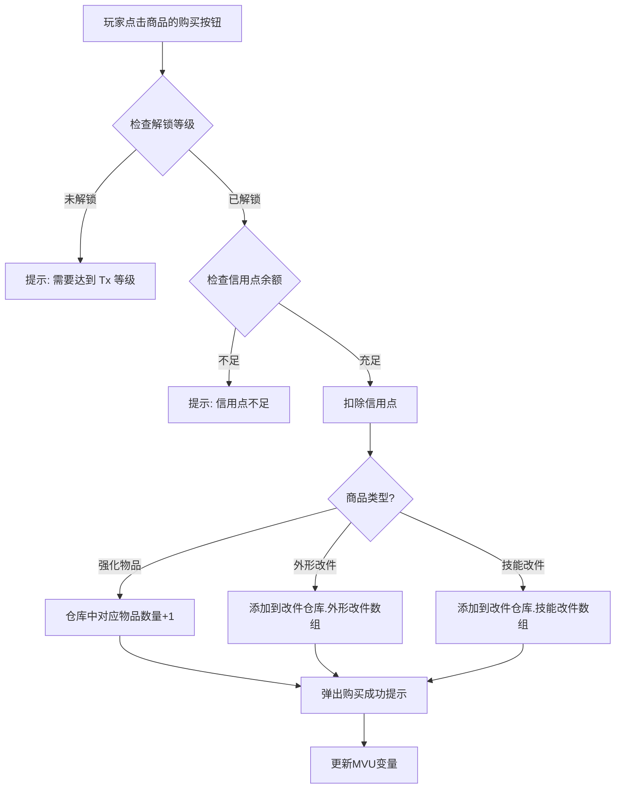

# 商城系统设计方案

## 核心原则

1. **所有商品预写在前端代码中**（`shopData.ts`），AI 不参与商城逻辑
2. **购买操作纯前端完成** — 点击购买→检查信用点→扣钱→入库→弹出成功提示
3. **维修/报名/调校不做成商城物品** — 在各自对应的面板中直接扣钱操作
4. **所有商品始终显示** — 未解锁的标注等级要求，灰色不可购买
5. **黑市独立入口** — 需要剧情解锁后才出现

---

## 一、商城界面设计

### 1.1 Tab 结构

正规商城 3 个 Tab + 黑市独立入口：

```
┌──────────────────────────────────────────────┐
│  💰 信用点: 12,500                            │
├──────────────────────────────────────────────┤
│  [强化物品]  [外形改件]  [技能改件]    🔒黑市  │
├──────────────────────────────────────────────┤
│  商品列表...                                  │
└──────────────────────────────────────────────┘
```

### 1.2 商品卡片展示

每个商品卡片显示：
- 物品名称
- 物品类型/分类标签
- 描述文字（1~2 句）
- 价格（信用点）
- 解锁等级要求（如「T2+」）
- 购买按钮 / 已拥有标记 / 锁定状态

### 1.3 筛选与排序

- **强化物品 Tab**：按维度筛选（加速度/极速/操控/漂移/耐久）+ 按品质排序
- **外形改件 Tab**：按类型筛选（尾翼/花纹/灯组/排气/空力套件/轮毂/赛车服/核心配色）+ 按价格排序
- **技能改件 Tab**：按效果方向筛选 + 按价格排序

---

## 二、商品总览

总计约 **86 个正规商品 + 4 个黑市商品 = 90 个商品**

| 大类 | 数量 | 说明 |
|------|------|------|
| 强化物品 | 15 | 5 维度 × 3 品质 |
| 外形改件 | 55 | 8 类型，各类型 4~12 个 |
| 技能改件（正规） | 8 | 4 效果方向 × 2 档次 |
| 技能改件（黑市） | 4 | 4 效果方向各 1 个 |
| **合计** | **82+4** | |

---

## 三、强化物品详细商品表（15 个）

强化物品是消耗品，可重复购买，用于强化机娘五维。

### 3.1 涡轮增压芯片（加速度 ACC）

| ID | 名称 | 品质 | 价格 | 描述 |
|----|------|------|------|------|
| E-ACC-1 | 涡轮增压芯片·基础型 | ⬜基础级 | 500 | 标准工业级增压芯片，为核心加速模块提供基础强化能量 |
| E-ACC-2 | 涡轮增压芯片·精密型 | 🟦精密级 | 2000 | 高纯度增压芯片，经过精密校准，强化效率显著提升（成功率+3~5%） |
| E-ACC-3 | 涡轮增压芯片·极品型 | 🟧极品级 | 5000 | 顶级赛事御用增压芯片，军工级精度，强化效率最大化（成功率+5~10%） |

### 3.2 极速调谐模块（极速 SPD）

| ID | 名称 | 品质 | 价格 | 描述 |
|----|------|------|------|------|
| E-SPD-1 | 极速调谐模块·基础型 | ⬜基础级 | 500 | 通用调谐模块，用于校准核心的极速输出频率 |
| E-SPD-2 | 极速调谐模块·精密型 | 🟦精密级 | 2000 | 高频调谐模块，以纳米级精度优化极速通道（成功率+3~5%） |
| E-SPD-3 | 极速调谐模块·极品型 | 🟧极品级 | 5000 | 竞赛级调谐模块，零误差校准，突破极速瓶颈（成功率+5~10%） |

### 3.3 操控稳定陀螺（操控 HDL）

| ID | 名称 | 品质 | 价格 | 描述 |
|----|------|------|------|------|
| E-HDL-1 | 操控稳定陀螺·基础型 | ⬜基础级 | 500 | 标准稳定陀螺，为核心的操控响应系统提供基础强化 |
| E-HDL-2 | 操控稳定陀螺·精密型 | 🟦精密级 | 2000 | 三轴精密陀螺，显著提升操控信号的传导精度（成功率+3~5%） |
| E-HDL-3 | 操控稳定陀螺·极品型 | 🟧极品级 | 5000 | 量子级稳定陀螺，业界最高精度的操控强化（成功率+5~10%） |

### 3.4 漂移校准棱镜（漂移 DFT）

| ID | 名称 | 品质 | 价格 | 描述 |
|----|------|------|------|------|
| E-DFT-1 | 漂移校准棱镜·基础型 | ⬜基础级 | 500 | 标准折射棱镜，校准核心的漂移角度感知回路 |
| E-DFT-2 | 漂移校准棱镜·精密型 | 🟦精密级 | 2000 | 高折射棱镜，精确优化漂移状态的感知灵敏度（成功率+3~5%） |
| E-DFT-3 | 漂移校准棱镜·极品型 | 🟧极品级 | 5000 | 全息棱镜，极致的漂移回路强化，职业车手的首选（成功率+5~10%） |

### 3.5 耐久强化纤维（耐久 END）

| ID | 名称 | 品质 | 价格 | 描述 |
|----|------|------|------|------|
| E-END-1 | 耐久强化纤维·基础型 | ⬜基础级 | 500 | 工业级碳纤维束，加固核心的耐久结构层 |
| E-END-2 | 耐久强化纤维·精密型 | 🟦精密级 | 2000 | 编织碳纤维束，多层交叉加固，耐久提升显著（成功率+3~5%） |
| E-END-3 | 耐久强化纤维·极品型 | 🟧极品级 | 5000 | 纳米碳管纤维，最高强度的耐久强化材料（成功率+5~10%） |

---

## 四、外形改件详细商品表（55 个）

外形改件不影响五维数值，纯粹改变赛车/赛车服外观。一次性购买，存入仓库后可反复安装/拆卸。

### 4.1 花纹改件（12 个）

| ID | 名称 | 档次 | 价格 | 解锁等级 | 描述 |
|----|------|------|------|---------|------|
| S-PTN-01 | 竞速条纹 | 基础 | 200 | T5 | 经典的双色平行条纹，简洁利落，新秀赛场常见的入门涂装 |
| S-PTN-02 | 碳纤维纹 | 基础 | 300 | T5 | 仿碳纤维编织纹理，低调中透出专业感 |
| S-PTN-03 | 闪电裂纹 | 基础 | 500 | T5 | 从车头延伸至车尾的锯齿闪电纹，充满速度感 |
| S-PTN-04 | 都市迷彩 | 精品 | 1200 | T5 | 城市街道灵感的几何迷彩，灰蓝配色 |
| S-PTN-05 | 烈焰涂装 | 精品 | 1500 | T5 | 从引擎盖蔓延的火焰纹样，红橙渐变 |
| S-PTN-06 | 星空渐变 | 精品 | 2000 | T4 | 深蓝到紫色的星空渐变，夜赛中格外亮眼 |
| S-PTN-07 | 赛博线路 | 精品 | 2500 | T4 | 模拟电路板的荧光线路纹样，科技感十足 |
| S-PTN-08 | 水墨山水 | 限定 | 5000 | T3 | 东方水墨画风格的泼墨涂装，黑白灰三色挥洒 |
| S-PTN-09 | 极光流彩 | 限定 | 8000 | T3 | 模拟北极光色彩的渐变涂装，角度不同色彩变化 |
| S-PTN-10 | 冰裂纹 | 限定 | 10000 | T2 | 宛如冰面碎裂的纹理，银白与冰蓝交织 |
| S-PTN-11 | 龙鳞甲 | 定制 | 15000 | T2 | 仿龙鳞的立体浮雕纹理，金属光泽随光线变幻 |
| S-PTN-12 | 虹光全息 | 定制 | 20000 | T1 | 全息投影材质涂装，车身在阳光下折射出彩虹色 |

### 4.2 尾翼改件（8 个）

| ID | 名称 | 档次 | 价格 | 解锁等级 | 描述 |
|----|------|------|------|---------|------|
| S-WNG-01 | 低矮鸭尾 | 基础 | 300 | T5 | 贴合车身的小型鸭尾翼，低调内敛 |
| S-WNG-02 | 标准GT尾翼 | 基础 | 500 | T5 | 经典GT赛车造型尾翼，碳纤维哑光质感 |
| S-WNG-03 | 双层刀锋翼 | 精品 | 1500 | T4 | 上下双层刀片式尾翼，攻击性外观 |
| S-WNG-04 | 天鹅颈尾翼 | 精品 | 2500 | T4 | 高位天鹅颈支架尾翼，优雅与力量并存 |
| S-WNG-05 | 可变角度翼 | 限定 | 6000 | T3 | 外观上模拟可变角度的机构造型，层次丰富 |
| S-WNG-06 | 透明水晶翼 | 限定 | 8000 | T2 | 透明材质尾翼，内嵌LED灯带，夜间发光 |
| S-WNG-07 | 浮空光翼 | 定制 | 12000 | T2 | 看似悬浮的分体式尾翼，极具未来感 |
| S-WNG-08 | 凤羽展翼 | 定制 | 15000 | T1 | 仿凤凰羽翼造型的大型尾翼，金红配色 |

### 4.3 灯组改件（7 个）

| ID | 名称 | 档次 | 价格 | 解锁等级 | 描述 |
|----|------|------|------|---------|------|
| S-LGT-01 | 鹰眼日行灯 | 基础 | 500 | T5 | 锐利的鹰眼造型LED日行灯，提升辨识度 |
| S-LGT-02 | 环形光圈灯 | 基础 | 800 | T5 | 四环光圈造型灯组，经典而辨识度高 |
| S-LGT-03 | 矩阵LED灯 | 精品 | 2000 | T4 | 像素矩阵式灯组，可显示简单图案 |
| S-LGT-04 | 激光刀灯 | 精品 | 3000 | T4 | 极细的激光切割灯带，锐利如刀锋 |
| S-LGT-05 | 流水转向灯 | 限定 | 5000 | T3 | 依次点亮的流水式转向灯，动态视觉效果 |
| S-LGT-06 | 全息投影灯 | 限定 | 8000 | T2 | 灯组投射全息光影，在车前方形成光幕 |
| S-LGT-07 | 星瞳灯组 | 定制 | 10000 | T1 | 模拟星空瞳孔的灯组，自带呼吸明灭效果 |

### 4.4 排气改件（6 个）

| ID | 名称 | 档次 | 价格 | 解锁等级 | 描述 |
|----|------|------|------|---------|------|
| S-EXH-01 | 双出圆管 | 基础 | 300 | T5 | 经典双圆管排气，抛光不锈钢材质 |
| S-EXH-02 | 四出方管 | 基础 | 600 | T5 | 四方管排气，钛合金烧蓝渐变色 |
| S-EXH-03 | 中置双出 | 精品 | 1800 | T4 | 中置布局的双排气管，赛道风格 |
| S-EXH-04 | 蓝焰排气 | 精品 | 3000 | T4 | 排气火焰为湛蓝色，高贵冷艳 |
| S-EXH-05 | 金焰排气 | 限定 | 6000 | T3 | 排气火焰为金色，华丽而张扬 |
| S-EXH-06 | 极光尾焰 | 定制 | 8000 | T2 | 排气尾焰呈现极光般的多彩渐变 |

### 4.5 空力套件（6 个）

| ID | 名称 | 档次 | 价格 | 解锁等级 | 描述 |
|----|------|------|------|---------|------|
| S-AERO-01 | 运动前唇 | 基础 | 1000 | T4 | 低矮的运动前唇，增加车头的攻击性 |
| S-AERO-02 | 宽体侧裙 | 精品 | 2500 | T4 | 加宽车身视觉效果的宽体侧裙套件 |
| S-AERO-03 | 碳纤维扩散器 | 精品 | 4000 | T3 | 后部碳纤维扩散器，暴露的碳纤维编织纹理 |
| S-AERO-04 | 全包围套件 | 限定 | 8000 | T3 | 前后包围+侧裙的完整空力套件 |
| S-AERO-05 | 赛道版套件 | 限定 | 12000 | T2 | 赛事级全包围套件，棱角分明的赛道风格 |
| S-AERO-06 | 概念车套件 | 定制 | 15000 | T1 | 未来概念车风格的流线型空力套件 |

### 4.6 轮毂改件（6 个）

| ID | 名称 | 档次 | 价格 | 解锁等级 | 描述 |
|----|------|------|------|---------|------|
| S-WHL-01 | 五辐经典 | 基础 | 500 | T5 | 经典五辐轮毂，银色抛光面 |
| S-WHL-02 | 十辐战斧 | 基础 | 800 | T5 | 十辐战斧造型，亚光黑配色 |
| S-WHL-03 | 旋风多辐 | 精品 | 2000 | T4 | 旋风式多辐轮毂，高速旋转时产生视觉漩涡 |
| S-WHL-04 | 碟面轮毂 | 精品 | 3500 | T4 | 封闭式碟面轮毂，极致的流线型外观 |
| S-WHL-05 | 锻造竞技轮 | 限定 | 7000 | T3 | 锻造工艺竞技轮毂，金色与黑色拼接 |
| S-WHL-06 | 全息投影轮 | 定制 | 12000 | T1 | 轮毂表面带有全息投影图案，旋转时显示不同图案 |

### 4.7 赛车服改件（6 个）

| ID | 名称 | 档次 | 价格 | 解锁等级 | 描述 |
|----|------|------|------|---------|------|
| S-SUIT-01 | 竞速黑红 | 基础 | 800 | T4 | 黑色底色配红色线条的经典赛车服配色 |
| S-SUIT-02 | 极地白蓝 | 基础 | 800 | T4 | 白色底色配冰蓝色纹样，清爽干练 |
| S-SUIT-03 | 暗夜紫金 | 精品 | 3000 | T3 | 深紫色底配金色装饰线，高贵而神秘 |
| S-SUIT-04 | 霓虹都市 | 精品 | 5000 | T3 | 赛博朋克风格的霓虹色赛车服，自带荧光线条 |
| S-SUIT-05 | 星辰战甲 | 限定 | 12000 | T2 | 深空色底配星光点缀，如同穿着星空 |
| S-SUIT-06 | 皇家定制 | 定制 | 20000 | T1 | 顶级手工定制赛车服，配色和纹样独一无二 |

### 4.8 核心配色改件（4 个）

| ID | 名称 | 档次 | 价格 | 解锁等级 | 描述 |
|----|------|------|------|---------|------|
| S-CORE-01 | 蓝焰核心 | 精品 | 2000 | T3 | 核心发光色调为冷蓝色，稳定柔和的光效 |
| S-CORE-02 | 猩红核心 | 精品 | 3000 | T3 | 核心发光色调为深红色，脉动式光效如同心跳 |
| S-CORE-03 | 极光核心 | 限定 | 15000 | T2 | 核心发光呈现极光般的多色渐变，缓慢流动 |
| S-CORE-04 | 虚空核心 | 定制 | 30000 | T1 | 核心发出近乎透明的暗光，边缘有微弱的光子溢散效果 |

---

## 五、技能改件详细商品表

### 5.1 正规技能改件（8 个）

每种效果方向有标准型和高级型两档。

| ID | 名称 | 效果方向 | 价格 | 解锁等级 | 描述 |
|----|------|---------|------|---------|------|
| K-DUR-1 | 恒流维持器 | 持续微调 | 5000 | T1 | 稳定核心输出频率，轻微延长共鸣技能持续时间（约+1秒） |
| K-DUR-2 | 永恒回路 | 持续微调 | 15000 | T1 | 高阶维持模块，优化共鸣能量的衰减曲线（约+2秒） |
| K-BCK-1 | 缓冲隔离片 | 反噬缓和 | 8000 | T1 | 在核心与神经回路之间增设缓冲层，略微降低技能反噬 |
| K-BCK-2 | 消散导流器 | 反噬缓和 | 20000 | T1 | 将反噬能量导入散热通道消散，恢复期缩短约15% |
| K-CHG-1 | 聚能谐振器 | 充能辅助 | 10000 | T1 | 加速共鸣值的自然积累，约提升10%充能速度 |
| K-CHG-2 | 量子蓄能环 | 充能辅助 | 25000 | T1 | 利用量子纠缠效应加速共鸣积累，约提升15%充能速度 |
| K-VFX-1 | 光效增幅棱镜 | 附带光效 | 5000 | T1 | 技能发动时产生额外的光芒扩散效果 |
| K-VFX-2 | 全息演出模块 | 附带光效 | 12000 | T1 | 技能发动时生成全息投影演出效果，观赏性极强 |

### 5.2 黑市技能改件（4 个）

黑市入口需要剧情解锁后才可见。

| ID | 名称 | 效果方向 | 价格 | 描述 | 副作用 |
|----|------|---------|------|------|--------|
| BK-DUR | 超限延展器 | 持续微调 | 3000 | 强行延长技能持续时间（约+4秒），效果远超正规品 | 使用后核心持续钝痛2~3小时，长期使用缩短核心寿命 |
| BK-BCK | 神经阻断片 | 反噬缓和 | 2500 | 直接阻断反噬痛觉信号，几乎感觉不到反噬 | 实际反噬仍在发生但感知不到，极易造成隐性损伤积累 |
| BK-CHG | 过载充能器 | 充能辅助 | 4000 | 强制加速共鸣值积累（约+40%），远超正规品 | 核心过热风险，极端情况下可能导致核心裂纹 |
| BK-VFX | 幻象发生器 | 附带光效 | 1500 | 产生极其炫目的幻象光效，甚至可能干扰对手视线 | 严格意义上属于违规（影响他人），被发现永久禁赛 |

---

## 六、购买流程



### 关键规则

1. **强化物品可重复购买** — 每次购买数量+1，是消耗品
2. **外形改件不可重复购买** — 每个外形改件只能买一次，买过的显示"已拥有"
3. **技能改件不可重复购买** — 同上
4. **黑市商品需要剧情解锁** — 初始状态黑市 Tab 显示锁定图标，AI 在剧情中引导玩家接触黑市后解锁

---

## 七、商品数据结构

### 7.1 shopData.ts 结构

```typescript
interface ShopItem {
  id: string;                    // 唯一ID
  name: string;                  // 商品名称
  category: 'enhance' | 'skin' | 'skill';  // 大类
  type: string;                  // 细分类型（如"花纹"、"持续微调"、"加速度"等）
  price: number;                 // 信用点价格
  unlockTier: 'T5' | 'T4' | 'T3' | 'T2' | 'T1' | 'T0';  // 解锁等级
  description: string;           // 描述文字
  tier?: '基础' | '精品' | '限定' | '定制';  // 外形改件档次
  quality?: '基础级' | '精密级' | '极品级';  // 强化物品品质
  effectDirection?: string;      // 技能改件效果方向
  isBlackMarket?: boolean;       // 是否黑市商品
  sideEffect?: string;           // 黑市商品副作用描述
  repeatable: boolean;           // 是否可重复购买
}
```

### 7.2 仓库变量结构（schema.ts 中的变更）

```typescript
改件仓库: z.object({
  外形改件: z.array(外形改件Schema).prefault([]),
  技能改件: z.array(技能改件Schema).prefault([]),
  强化物品: z.record(
    z.string().describe('物品ID'),
    z.coerce.number().transform(v => Math.max(v, 0)).prefault(0)
  ).prefault({}),
}).prefault({}),
```

强化物品用 `Record<物品ID, 数量>` 存储，例如：
```json
{
  "E-ACC-1": 3,
  "E-SPD-2": 1
}
```

---

## 八、需要修改/新建的文件

| 文件 | 操作 | 说明 |
|------|------|------|
| 新建 `界面/PC版/panels/shopData.ts` | 新建 | 所有商品数据定义（约90个商品对象） |
| `界面/PC版/panels/PanelShop.vue` | 重写 | 3 Tab + 黑市入口 + 筛选排序 + 购买逻辑 |
| `schema.ts` | 修改 | 改件仓库增加强化物品字段（Record结构） |
| `世界书/金融设定.yaml` | 修改 | 增加完整商品价格参考 |
| `initvar.yaml` | 修改 | 增加强化物品初始值 |
