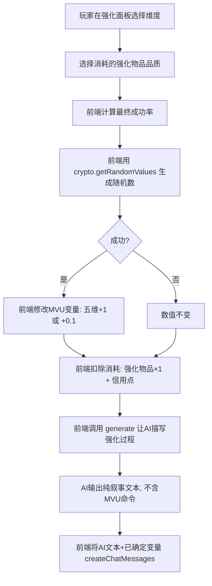

# 强化系统设计方案

## 核心原则

1. **AI 不参与任何强化计算过程** — 所有成功率计算、随机判定、消耗扣除、数值修改都由前端 JavaScript 完成
2. **AI 只负责结果叙事** — 前端计算完毕后调用 `generate`，prompt 中告知 AI 本次结果（成功/失败、维度、数值变化），AI 仅输出一段生动的描写
3. **失败无保底、无降级** — 失败只损失消耗品（强化物品 + 信用点），数值不变，没有连败保底机制
4. **强化物品维度与比赛类型绑定** — 逼玩家打不同类型比赛来获取不同维度的强化物品

---

## 一、强化流程



---

## 二、强化物品

### 2.1 五种强化物品（对应五维）

| 物品名称 | 对应维度 | 图标色 |
|---------|---------|-------|
| 涡轮增压芯片 | 加速度 ACC | 🔴 |
| 极速调谐模块 | 极速 SPD | 🟡 |
| 操控稳定陀螺 | 操控 HDL | 🔵 |
| 漂移校准棱镜 | 漂移 DFT | 🟣 |
| 耐久强化纤维 | 耐久 END | 🟢 |

### 2.2 三种品质

| 品质 | 商城价格 | 获取途径 |
|------|---------|---------|
| ⬜ 基础级 | 500 信用点 | 商城购买 / T5+ 比赛奖励 |
| 🟦 精密级 | 2000 信用点 | 商城购买 / T3+ 比赛奖励 |
| 🟧 极品级 | 5000 信用点 | 商城购买 / T1+ 比赛奖励 |

### 2.3 品质成功率加成（递减式）

| 品质 | 0~75 区间 | 76~92 区间 | 93~100 区间 | 100+ 小数区间 |
|------|----------|----------|-----------|-------------|
| ⬜ 基础级 | +0% | +0% | +0% | +0% |
| 🟦 精密级 | +5% | +3% | +1% | +0.5% |
| 🟧 极品级 | +10% | +5% | +2% | +1% |

---

## 三、成功率计算

### 最终成功率 = min(因子A + 因子B + 因子C, 95%)，下限 0.5%

### 3.1 因子A：当前维度值区间基础率

| 当前值区间 | 天赋维度基础率 | 非天赋维度基础率 |
|-----------|-------------|---------------|
| 0~30 | 95% | 80% |
| 31~50 | 90% | 65% |
| 51~65 | 80% | 45% |
| 66~75 | 65% | 30% |
| 76~85 | 45% | 18% |
| 86~92 | 25% | 8% |
| 93~97 | 12% | 3% |
| 98~99 | 5% | 1% |
| 100（冲击满分） | 2% | 0.5% |
| 100.1~100.9（精密强化） | 2% | 0.5% |

### 3.2 因子B：整体赛车等级加成

根据机娘**五维总和**判定隐性 Tier：

| 五维总和区间 | 隐性 Tier | 成功率修正 |
|------------|---------|-----------|
| 0~200 | 入门 | +0% |
| 201~280 | T5 级 | +3% |
| 281~350 | T4 级 | +5% |
| 351~400 | T3 级 | +7% |
| 401~440 | T2 级 | +4% |
| 441~470 | T1 级 | +2% |
| 471~500+ | T0 级 | +0% |

设计意图：中段车享有更多加成，高端车加成递减，保证越强越难。

### 3.3 因子C：强化物品品质加成

见 2.3 节递减式加成表。

---

## 四、信用点消耗

| 当前值区间 | 天赋维度消耗 | 非天赋维度消耗 |
|-----------|-----------|-------------|
| 0~50 | 500 | 1000 |
| 51~75 | 1000 | 3000 |
| 76~85 | 2000 | 5000 |
| 86~92 | 3000 | 8000 |
| 93~97 | 5000 | 15000 |
| 98~100 | 10000 | 30000 |
| 100.1~100.9 | 20000 | 50000 |

**每次强化消耗 = 1个对应维度的强化物品 + 对应区间的信用点**

---

## 五、T0 后精密强化

当某维度达到 100 后，开启精密强化模式：

- 每次强化 +0.1（100.0 → 100.1 → ... → 100.9）
- 上限 100.9
- 成功率极低（天赋 2% + 物品加成，非天赋 0.5% + 物品加成）
- 消耗极高（20000~50000 信用点）
- 雷达图和数值显示小数点后一位

---

## 六、比赛奖励强化物品

### 6.1 比赛类型 → 强化物品维度映射

| 比赛类型 | 主维度奖励 | 副维度奖励 |
|---------|-----------|-----------|
| 场地赛 | 🟡 极速调谐模块 | 🔴 涡轮增压芯片 |
| 街道赛 | 🔵 操控稳定陀螺 | 🟣 漂移校准棱镜 |
| 拉力赛 | 🟢 耐久强化纤维 | 🔵 操控稳定陀螺 |
| 漂移赛 | 🟣 漂移校准棱镜 | — |
| 耐力赛 | 🟢 耐久强化纤维 | 🟡 极速调谐模块 |

### 6.2 比赛级别 × 名次 → 奖励数量

冠军获得主+副维度物品，亚军/季军/参与奖只获得主维度物品。

| 赛事级别 | 冠军 | 亚军 | 季军 | 参与奖 |
|---------|------|------|------|--------|
| T5 新秀赛 | 基础级×2（主1副1） | 基础级×1（主） | — | — |
| T4 城市赛 | 基础级×3（主2副1） | 基础级×2（主） | 基础级×1（主） | — |
| T3 区域赛 | 精密级×1 + 基础级×2（主+副） | 基础级×3（主） | 基础级×2（主） | 基础级×1（主） |
| T2 国家赛 | 精密级×2（主1副1） | 精密级×1 + 基础级×2（主） | 精密级×1（主） | 基础级×1（主） |
| T1 洲际赛 | 极品级×1 + 精密级×1（主+副） | 精密级×2（主） | 精密级×1（主） | 基础级×2（主） |
| T0 世界赛 | 极品级×2（主1副1） | 极品级×1 + 精密级×1（主） | 精密级×2（主） | 精密级×1（主） |

---

## 七、前端随机数方案

使用 `crypto.getRandomValues()` 实现密码学安全随机：

```typescript
function secureRandom(): number {
  const array = new Uint32Array(1);
  crypto.getRandomValues(array);
  return array[0] / (0xFFFFFFFF + 1);
}

function rollEnhance(successRate: number): boolean {
  return secureRandom() < successRate;
}
```

特点：基于操作系统熵源，无法预测或逆推，每次调用完全独立。

---

## 八、schema.ts 变更计划

### 新增：强化物品 Schema

```typescript
const 强化物品Schema = z.object({
  名称: z.string().prefault(''),
  对应维度: z.enum(['加速度', '极速', '操控', '漂移', '耐久']).prefault('加速度'),
  品质: z.enum(['基础级', '精密级', '极品级']).prefault('基础级'),
  数量: z.coerce.number().transform(v => Math.max(v, 0)).prefault(0),
}).prefault({});
```

### 修改：主角.改件仓库 增加强化物品

```typescript
改件仓库: z.object({
  外形改件: z.array(外形改件Schema).prefault([]),
  技能改件: z.array(技能改件Schema).prefault([]),
  强化物品: z.array(强化物品Schema).prefault([]),  // 新增
}).prefault({}),
```

### 修改：五维上限从 100 改为 100.9

```typescript
加速度: z.coerce.number()
  .transform(v => _.clamp(Math.round(v * 10) / 10, 0, 100.9))
  .prefault(0),
// 极速、操控、漂移、耐久同理
```

---

## 九、需要修改的文件清单

| 文件 | 修改内容 |
|------|---------|
| `schema.ts` | 新增强化物品Schema、修改五维上限为100.9、改件仓库增加强化物品字段 |
| `世界书/机娘设定.yaml` | 更新强化系统说明，增加强化物品描述 |
| `世界书/金融设定.yaml` | 增加强化物品价格、比赛奖励强化物品说明 |
| `界面/PC版/panels/PanelEnhance.vue` | 实现完整强化交互界面 |
| `界面/PC版/panels/PanelShop.vue` | 增加强化物品购买 Tab |
| 新建 `界面/PC版/panels/enhance.ts` | 强化逻辑工具函数（成功率计算、随机判定、消耗扣除） |
| `世界书/变量/initvar.yaml` | 增加强化物品初始值 |
