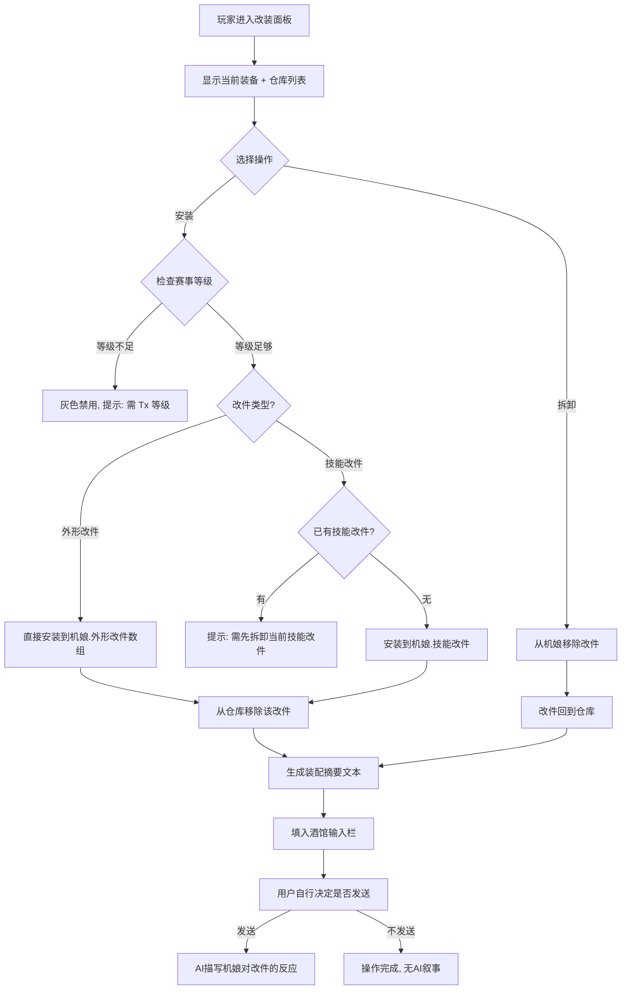

# 改装系统设计方案

## 核心原则

1. **安装/拆卸操作纯前端完成** — 点击按钮直接操作 MVU 变量
2. **安装完成后生成结果摘要，填入酒馆输入栏** — 用户自行决定是否发送给 AI 来描写机娘反应
3. **赛事等级限制前端强制检查** — 不够等级的操作直接灰色禁用

---

## 一、改装规则

| 规则 | 说明 |
|------|------|
| 外形改件 | 无限叠加安装，纯外观效果 |
| 技能改件 | 最多安装 1 件，需先拆卸旧件才能装新件 |
| T5~T3 | 禁止使用任何改件（安装按钮禁用） |
| T2 | 解锁外形改件（可安装外形，技能仍禁止） |
| T1+ | 解锁全部（外形+技能均可安装） |
| 安装费用 | 免费，无额外消耗 |
| 拆卸 | 免费，改件回到仓库 |

---

## 二、改装流程



---

## 三、装配摘要模板

安装完成后，前端生成一段文本填入酒馆输入栏：

### 安装外形改件：
```
（我为{机娘名}安装了外形改件「{改件名}」——{改件描述}。描写{机娘名}看到新外观后的反应。）
```

### 安装技能改件：
```
（我为{机娘名}的核心插入了技能改件「{改件名}」（{效果方向}）——{改件描述}。描写{机娘名}感受到核心变化时的反应。）
```

### 安装黑市技能改件：
```
（我为{机娘名}的核心插入了来路不明的技能改件「{改件名}」（{效果方向}）——{改件描述}。{机娘名}的核心对这个改件产生了异样的感觉。描写她的反应和可能的不适。）
```

### 拆卸改件：
```
（我从{机娘名}身上拆卸了改件「{改件名}」。描写{机娘名}的反应。）
```

---

## 四、界面布局（PanelMod.vue）

```
┌─ 改装 · {机娘名} ──────────────────────────────┐
│                                                │
│ ┌─ 当前装备 ─────────────────────────────────┐ │
│ │ 外形改件:                                    │ │
│ │   [竞速条纹 ✕] [鹰眼日行灯 ✕] [双出圆管 ✕]  │ │
│ │ 技能改件:                                    │ │
│ │   [恒流维持器 ✕]  或  ⬜ 空槽位              │ │
│ └──────────────────────────────────────────┘ │
│                                                │
│ ┌─ 仓库 ──────────── 筛选:[全部▾] ──────────┐ │
│ │ ┌──────────────┐ ┌──────────────┐         │ │
│ │ │ 星空渐变      │ │ 四出方管      │         │ │
│ │ │ 花纹 · 精品   │ │ 排气 · 基础   │         │ │
│ │ │ [安装]        │ │ [安装]        │         │ │
│ │ └──────────────┘ └──────────────┘         │ │
│ │ ┌──────────────┐                          │ │
│ │ │ 消散导流器    │ 🔒 需T1等级              │ │
│ │ │ 技能·反噬缓和 │                          │ │
│ │ │ [安装] (灰色)  │                          │ │
│ │ └──────────────┘                          │ │
│ └──────────────────────────────────────────┘ │
└────────────────────────────────────────────────┘
```

### 交互细节

1. **当前装备区域**：显示已安装的所有改件，每个改件右边有 ✕ 按钮可拆卸
2. **仓库区域**：显示仓库中所有未安装的改件
3. **筛选下拉**：全部 / 外形改件 / 技能改件
4. **安装按钮状态**：
   - 🟢 可安装：等级足够，按钮高亮
   - 🔴 等级不足：按钮灰色，旁边显示"需Tx等级"
   - 🟡 技能槽已满：按钮灰色，显示"需先拆卸当前技能改件"

---

## 五、变量操作

### 安装外形改件
```typescript
// 从仓库移除
data.主角.改件仓库.外形改件.splice(index, 1);
// 安装到机娘
data.机娘库[mechName].外形改件.push(item);
```

### 安装技能改件
```typescript
// 检查是否已有技能改件
if (data.机娘库[mechName].技能改件 !== null) {
  // 提示需先拆卸
  return;
}
// 从仓库移除
data.主角.改件仓库.技能改件.splice(index, 1);
// 安装到机娘
data.机娘库[mechName].技能改件 = item;
```

### 拆卸外形改件
```typescript
// 从机娘移除
const item = data.机娘库[mechName].外形改件.splice(index, 1)[0];
// 回到仓库
data.主角.改件仓库.外形改件.push(item);
```

### 拆卸技能改件
```typescript
// 从机娘移除
const item = data.机娘库[mechName].技能改件;
data.机娘库[mechName].技能改件 = null;
// 回到仓库
data.主角.改件仓库.技能改件.push(item);
```

---

## 六、填入输入栏的实现方式

使用酒馆助手的接口将文本填入输入栏，而不是直接发送：

```typescript
// 获取酒馆输入框的 jQuery 实例并填入文本
$('#send_textarea').val(summaryText);
// 聚焦输入框，让用户看到并决定是否发送
$('#send_textarea').trigger('focus');
```

---

## 七、需要修改/新建的文件

| 文件 | 操作 | 说明 |
|------|------|------|
| `界面/PC版/panels/PanelMod.vue` | 重写 | 完整的安装/拆卸交互界面 |
| 新建 `界面/PC版/panels/modLogic.ts` | 新建 | 安装/拆卸逻辑 + 摘要文本生成 |
