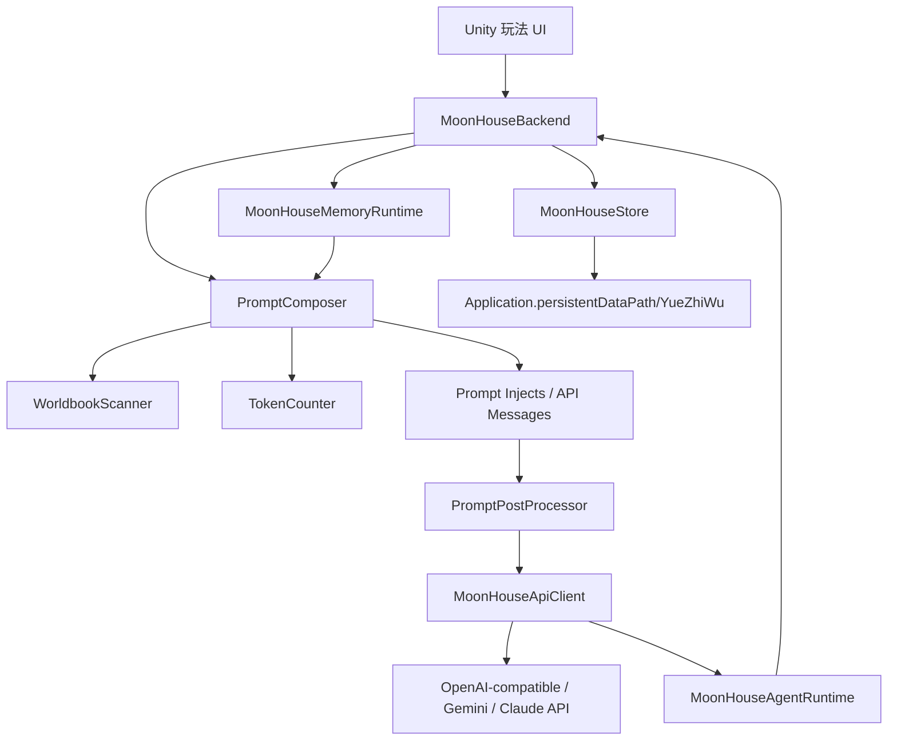

# 月之屋架构

月之屋的目标不是“Unity 版 SillyTavern UI”，而是一个能嵌入游戏的 AIRP 后端层。游戏表现、养成结算、角色演出都留给 Unity；月之屋负责提示词、世界书、模型 API 与存档。



## 运行链路

1. Unity UI 把玩家本轮行为传给 `MoonHouseBackend.GenerateStoryAsync`。
2. `PromptComposer` 把行为包成 `<player_action>`。
3. `WorldbookScanner` 按最近聊天与本轮行为激活世界书条目。
4. `PromptComposer` 将角色、人设、场景、世界书、运行记录分配到 `prompt_slot`。
5. `MoonHousePromptPostProcessor` 按预设决定是否保持多消息、折叠成单 user、或执行 NOASS 风格后处理。
6. `MoonHouseApiClient` 按 provider 发送 OpenAI-compatible、Gemini 或 Claude 请求。
7. `MoonHouseAgentRuntime` 解析隐藏 JsonActions 或原生 tool calls，更新游戏状态、变量、上下文块和世界书。
8. 如果原生函数调用只返回工具结果没有正文，`MoonHouseBackend` 会把工具结果回灌给模型，补一次最终可见回复；失败时回滚本轮未保存的工具改动。
9. 可见回复写入 `MoonHouseSave.messages` 并落盘。
10. `MoonHouseMemoryRuntime` 可按间隔生成长期记忆大总结，并在后续提示词中注入剧情摘要、角色记忆链和动态人设。

## 模型列表

`MoonHouseApiClient.FetchModelsAsync` 会按 provider 请求模型列表：

```text
openai_compatible: GET {Endpoint Base Url}/models
gemini: GET https://generativelanguage.googleapis.com/v1beta/models
claude: GET https://api.anthropic.com/v1/models
```

如果 `Endpoint Base Url` 已经填到 `/chat/completions`、`/completions` 或原生生成地址，月之屋会自动退回到根路径再拼模型列表地址。返回的模型 ID 会保存到 `generationPreset.availableModels`，Unity 面板用下拉框写回 `generationPreset.model`。

## 核心文件

- `MoonHouseBackend.cs`：游戏侧唯一需要直接挂载的 MonoBehaviour。
- `MoonHouseDevConsole.cs`：无 UI 阶段的 Inspector 调试组件。
- `MoonHouseDemoUI.cs`：自动生成的最小可玩聊天界面。
- `MoonHouseConfig.cs`：Inspector 配置入口，包含预设、世界书和常驻上下文。
- `MoonHouseApiClient.cs`：OpenAI-compatible、Gemini、Claude API 客户端。
- `MoonHouseAgentRuntime.cs`：月之屋内置 Agent 工具、JsonActions 和原生 tool schema。
- `MoonHouseMemoryRuntime.cs`：长期记忆、大总结解析、神经链记忆激活和总结历史裁剪。
- `MoonHousePromptPostProcessor.cs`：默认、多消息折叠、NOASS 风格提示词后处理。
- `PromptComposer.cs`：把预设、历史、世界书和本轮输入装配成 API messages。
- `WorldbookScanner.cs`：世界书激活逻辑。
- `TokenCounting.cs`：token 预算接口，目前是启发式估算。
- `MoonHouseStore.cs`：本地 JSON 存档。
- `MoonHouseConfigEditor.cs`：Unity 编辑器里的模型刷新按钮与模型下拉框。

## 与旧项目的对应关系

| 旧项目 TypeScript | Unity 月之屋 |
| --- | --- |
| `core/promptComposer.ts` | `PromptComposer.cs` |
| `core/narration.ts` | `MoonHouseBackend.cs` + `MoonHouseApiClient.cs` |
| `core/worldbook.ts` | `WorldbookScanner.cs` |
| `core/save.ts` | `MoonHouseStore.cs` |
| `generate.injects` | `PromptInjection` |
| `GameSave.messages` | `MoonHouseSave.messages` |

## 预设适配器

当前有两个约定：

- `mingyue_qiuqing_bad_end`：把每个 `prompt_slot` 包进 `<observed_piece class="设定">`，贴合你旧项目的边界。
- 其他字符串：直接注入 `prompt_slot`，用于更通用的模型或未来专属预设。

## 世界书策略

第一版保留最有用、最稳定的一组规则：

- 常驻条目：每轮进入上下文。
- 关键词条目：命中最近聊天或本轮操作后进入上下文。
- 二级关键词：支持 AND_ANY、AND_ALL、NOT_ANY、NOT_ALL。
- 递归：被激活的条目内容可继续触发其他条目。
- 预算：按 `contextTokens * budgetPercent` 裁剪，避免世界书挤爆上下文。
- 分组竞争：同组条目默认只保留优先级最高、order 最靠前的一条。
- delay/sticky/cooldown：适合伏笔、持续设定和防止重复刷屏。

后续建议补：

- 远端世界工坊模块下载与审核。
- 更准的 tokenizer 后端。
- 长期记忆 UI：手动总结、回退总结、编辑角色记忆、查看隐藏/已压缩历史。

## 迁移路线

1. 先把现有 `我的养成仙子女友` 的固定世界观、人设、玩家资料转成 `MoonHouseContextBlock`。
2. 把地图、NPC、秘境、宗门拆成 `WorldbookEntry`。
3. 把养成结算和背包解析迁到 Unity C#，保持“前端/游戏权威结算”。
4. API 稳定后，再做角色卡编辑器、世界工坊和跨设备存档。
